<p align="center">
  
</p>

<div align="center">

<br/>

<p align="center">
  <strong>Orchestrates the full loop: confirms Kafka + the producer are healthy,<br/>
  triggers one Databricks AvailableNow run, promotes staging into the dimensional model,<br/>
  validates the result, and notifies — all in one DAG.</strong>
</p>

<br/>

<p align="center">
  
  
  
  
  
  
  
  
</p>

<br/>

<table>
<tr>
  <td align="center"><br/><sub><b>Infra → Stream → Promote → Validate → Notify</b></sub></td>
  <td align="center"><br/><sub><b>Independent failure domains</b></sub></td>
  <td align="center"><br/><sub><b>Zero plaintext credentials</b></sub></td>
  <td align="center"><br/><sub><b>Databricks mode</b></sub></td>
</tr>
</table>

<br/>

<p align="center">
  Read <a href="ARCHITECTURE.md"><b>ARCHITECTURE.md</b></a> first — it explains <em>why</em> each piece is designed the way it is.<br/>
  Then <a href="DEPLOYMENT_GUIDE.md"><b>DEPLOYMENT_GUIDE.md</b></a> to set up, and <a href="VERIFICATION_GUIDE.md"><b>VERIFICATION_GUIDE.md</b></a> to prove it works.
</p>

</div>


<a id="toc"></a>
<p align="center"></p>

<table><tr><td>

| Section | Section |
|---|---|
| 📊 [Overview](#overview) | 📦 [DAG Overview](#dag-overview) |
| 🏗️ [Architecture](#architecture) | 🛠️ [Technologies](#technologies) |
| 💡 [Why Airflow?](#why-airflow) | ⚡ [Key Features](#key-features) |
| 🎯 [Design Philosophy](#design-philosophy) | 🔐 [Design Principles](#design-principles) |
| 🔄 [Workflow](#workflow) | 🗺️ [Future Improvements](#future-improvements) |
| 📁 [Repository Structure](#repository-structure) | 🚀 [Deployment](#deployment) |
| ✅ [Verification](#verification) | 🤝 [Contributing](#contributing) |

</td></tr></table>


<a id="overview"></a>
<p align="center"></p>

**DataDose Airflow Orchestration** is the workflow orchestration layer of the DataDose AI-Powered Clinical Decision Intelligence Platform.

It is responsible for coordinating the end-to-end healthcare data pipeline, ensuring that every component executes in the correct order while validating infrastructure availability, monitoring streaming health, triggering analytics workloads, promoting validated data into the dimensional warehouse, executing data quality checks, and sending operational notifications.

Unlike traditional ETL schedulers that only execute SQL scripts, this project orchestrates an entire modern cloud data platform:

<table>
<tr>
<td width="33%" valign="top">

**Platform Services**
* Apache Kafka (Aiven)
* Databricks Structured Streaming
* Snowflake Data Warehouse
* Neo4j AuraDB

</td>
<td width="33%" valign="top">

**Infrastructure**
* Apache Airflow
* Docker Compose
* Slack Notifications
* Airflow Connections (encrypted)

</td>
<td width="33%" valign="top">

**Guarantee**
Downstream processing only begins after all upstream services have been successfully verified.

</td>
</tr>
</table>

<p align="right"><sub><a href="#toc">↑ back to top</a></sub></p>


<a id="architecture"></a>
<p align="center"></p>

```
Producer Simulator (Docker — always-on)
        │
        ▼
 Apache Kafka  (Aiven — managed)
        │
        ▼
Databricks Streaming  ──  AvailableNow mode (finite, Airflow-triggered)
        │
        ▼
Snowflake Staging  (STG_TRANSACTION)
        │
        ▼
Promotion SQL  (MERGE → DIM_* / FACT_*)
        │
        ▼
Dimensional Warehouse  (validated, surrogate keys resolved)
        │
        ▼
Validation & Data Quality  (freshness, nulls, duplicates, referential integrity)
        │
        ▼
Slack Notification  (#datadose-alerts)
```

> See [`ARCHITECTURE.md`](ARCHITECTURE.md) for the full rationale behind every boundary decision.

<p align="right"><sub><a href="#toc">↑ back to top</a></sub></p>


<a id="why-airflow"></a>
<p align="center"></p>

Apache Airflow was selected because it provides everything the DataDose pipeline needs in one place:

<table>
<tr>
<td width="50%" valign="top">

**Operational capabilities**
* Workflow orchestration with explicit task dependencies
* Automatic retries with configurable backoff
* Built-in scheduler with cron-style expressions
* Comprehensive logging per task
* Web UI for monitoring and manual triggers

</td>
<td width="50%" valign="top">

**Architectural fit**
* Python-native — business logic lives in reusable Python modules, not embedded in the DAG
* Airflow Connections for encrypted, backend-swappable credentials
* `max_active_runs=1` prevents concurrent promotion SQL collisions
* Extensible through providers (Databricks, Snowflake, Slack all have official providers)

</td>
</tr>
</table>

Rather than embedding business logic directly inside Airflow, the DAG orchestrates independent validation modules implemented as reusable Python components. This keeps the DAG clean while making validation logic reusable and testable in isolation.

<p align="right"><sub><a href="#toc">↑ back to top</a></sub></p>


<a id="design-philosophy"></a>
<p align="center"></p>

The most important architectural decision: **Airflow does not manage long-running services.**

| Component | Runs forever? | Owner |
|---|---|---|
| Kafka broker | Yes (Aiven-managed) | External — Airflow only checks connectivity |
| Producer simulator | Yes (`while True`) | Docker Compose `restart: always` — Airflow only checks it's producing |
| Databricks notebook run | No — `availableNow=True` drains and exits | Airflow task, triggered on schedule |
| Snowflake staging → dimensional promotion | No — a SQL statement that finishes | Airflow task |
| Snowflake data-quality checks | No | Airflow task |

This design follows production best practices: Airflow is designed to orchestrate tasks with a clear beginning and end. Long-lived processes remain under Docker's supervision, while Airflow periodically verifies their health rather than controlling their lifecycle.

**On credentials:** `.env` holds only Airflow's own bootstrap secrets (Fernet key, webserver secret, admin password, Postgres password). Everything about Kafka, Snowflake, Neo4j, and Databricks lives in Airflow Connections — encrypted at rest, only decrypted in-memory at task execution time, and swappable to Azure Key Vault with zero DAG code changes.

<p align="right"><sub><a href="#toc">↑ back to top</a></sub></p>


<a id="workflow"></a>
<p align="center"></p>

The pipeline executes in five logical stages. Each stage is a unit that either fully succeeds or fully fails together — and each failure means something specific and actionable.

<details open>
<summary><b>Stage 1 — Infrastructure Validation</b></summary>
<br/>

Before processing begins, Airflow verifies that all critical services are available:

| Check | Failure means |
|---|---|
| Airflow Connections present | Config problem — fix before any task runs |
| SSL Certificate valid | `ca.pem` missing or expired |
| Kafka Broker reachable | Network/credentials issue |
| Kafka Producer active | `producer-simulator` container stopped or stale |
| Snowflake connectivity | Auth or network issue |
| Neo4j connectivity | Graph DB unavailable |

Pipeline execution **stops immediately** if any validation fails.

</details>

<details>
<summary><b>Stage 2 — Streaming Processing</b></summary>
<br/>

Airflow triggers a Databricks job configured in **`AvailableNow` mode**:
* Processes all available Kafka records accumulated since the last run
* Writes results into Snowflake staging tables (`STG_TRANSACTION`)
* **Terminates automatically** — unlike continuous streaming, it behaves like a finite batch job, making it suitable for Airflow orchestration

</details>

<details>
<summary><b>Stage 3 — Warehouse Promotion</b></summary>
<br/>

Promotion SQL executes to move validated records from staging into the dimensional warehouse:
* MERGE operations with `NOT EXISTS` guards (idempotent — safe to retry)
* Dimension loading (`DIM_DRUG`, `DIM_PHARMACY`, `DIM_PATIENT`)
* Fact table loading (`FACT_PRESCRIPTION_TRANSACTION`) with surrogate key resolution
* Transaction consistency guaranteed — if any step fails, staging rows remain `IS_PROCESSED = FALSE`

</details>

<details>
<summary><b>Stage 4 — Validation</b></summary>
<br/>

Airflow executes data quality queries:
* Row count verification (freshness check)
* Missing record detection
* Duplicate detection
* Referential integrity checks (no NULL surrogate keys in the fact table)
* Business rule validation

The pipeline only continues if **every validation succeeds**.

</details>

<details>
<summary><b>Stage 5 — Notification</b></summary>
<br/>

On success or failure, Slack receives a notification containing: pipeline status, execution duration, completion timestamp, and specific failure information if any stage failed.

</details>

<p align="right"><sub><a href="#toc">↑ back to top</a></sub></p>


<a id="repository-structure"></a>
<p align="center"></p>

```
.
├── ARCHITECTURE.md                              # design rationale — read this first
├── DEPLOYMENT_GUIDE.md                          # step-by-step setup
├── VERIFICATION_GUIDE.md                        # how to prove everything works
├── .env.example                                 # Airflow's OWN secrets + producer creds only
├── requirements.txt
│
├── dags/
│   ├── datadose_pipeline.py                     # the DAG: 4 task groups + notify
│   └── databricks_job_spec.py
│
├── src/
│   ├── airflow_checks/
│   │   ├── common.py                            # ALL Connection/config access goes here
│   │   ├── verify_connections.py
│   │   ├── verify_certificate.py
│   │   ├── verify_kafka_broker.py
│   │   ├── verify_kafka_producer_activity.py    # checks producer is alive, not just broker
│   │   ├── verify_snowflake.py
│   │   ├── verify_neo4j.py
│   │   ├── load_dimensional_model.py            # promotes staging → DIM_*/FACT_*
│   │   ├── validate_snowflake_load.py
│   │   └── data_quality_checks.py
│   │
│   └── producer/
│       └── producer_simulator.py                # runs as its own Docker service
│
├── sql/
│   ├── promote_dimensional_model.sql            # MERGE statements — review before running
│   └── validation_queries.sql
│
├── docker/
│   ├── docker-compose.airflow.yaml
│   ├── Dockerfile.airflow
│   └── Dockerfile.producer
│
├── certs/                                       # gitignored — ca.pem goes here
└── data/                                        # gitignored — output_FINAL.csv goes here
```

<p align="right"><sub><a href="#toc">↑ back to top</a></sub></p>


<a id="dag-overview"></a>
<p align="center"></p>

```
kafka_orchestration
  ├── verify_connections
  ├── verify_certificate
  ├── verify_kafka_broker
  └── verify_kafka_producer_activity
        │
databricks_processing
  ├── verify_snowflake
  ├── verify_neo4j
  └── run_databricks_notebook   ← waits for AvailableNow job to complete
        │
snowflake_transformation
  └── load_dimensional_model    ← promotion SQL (MERGE → DIM_*/FACT_*)
        │
snowflake_validation
  ├── validate_snowflake_load
  └── data_quality_checks
        │
notify_success / notify_failure
```

| Task Group | What it guards |
|---|---|
| `kafka_orchestration` fails | Nothing to process — no point calling Databricks |
| `databricks_processing` fails | Notebook broke — staging never got new rows |
| `snowflake_transformation` fails | Staging has rows but not promoted — safe to retry |
| `snowflake_validation` fails | Data landed but looks wrong — investigate before trusting dashboards |

**Schedule:** `*/2 * * * *` (every 2 minutes), `max_active_runs=1` so promotion SQL never runs concurrently against the same rows.

<p align="right"><sub><a href="#toc">↑ back to top</a></sub></p>


<a id="technologies"></a>
<p align="center"></p>

| Category | Technology |
|---|---|
| Workflow Orchestration | Apache Airflow |
| Streaming Platform | Apache Kafka (Aiven) |
| Stream Processing | Databricks Structured Streaming (`AvailableNow`) |
| Data Warehouse | Snowflake |
| Graph Database | Neo4j AuraDB |
| Containerization | Docker Compose |
| Language | Python 3 |
| SQL Engine | Snowflake SQL |
| Notifications | Slack (Incoming Webhooks) |
| Secrets | Airflow Connections (Fernet-encrypted) |

<p align="right"><sub><a href="#toc">↑ back to top</a></sub></p>


<a id="key-features"></a>
<p align="center"></p>

<table>
<tr>
<td width="50%" valign="top">

**Infrastructure & Security**
* Infrastructure health validation before any processing
* Kafka producer activity monitoring (not just broker reachability)
* Airflow Connections for all pipeline credentials — encrypted at rest
* `.env` holds only Airflow's own bootstrap secrets

</td>
<td width="50%" valign="top">

**Pipeline**
* Automatic Databricks job execution (`AvailableNow` — finite, not continuous)
* Warehouse promotion workflow (MERGE, idempotent)
* Data quality validation with specific, actionable failure messages
* `max_active_runs=1` — no concurrent promotion SQL collisions

</td>
</tr>
<tr>
<td width="50%" valign="top">

**Observability**
* Slack alerts on success and failure
* Per-task logs in Airflow UI
* Dead-letter and staleness checks surfaced as specific task failures
* Manual trigger support from Airflow UI

</td>
<td width="50%" valign="top">

**Architecture**
* Modular Python validation components (each independently testable)
* Idempotent task execution throughout
* Docker-based deployment with `restart: always` for long-running services
* Production-oriented separation of orchestration and business logic

</td>
</tr>
</table>

<p align="right"><sub><a href="#toc">↑ back to top</a></sub></p>


<a id="design-principles"></a>
<p align="center"></p>

* **Separation of orchestration and business logic** — DAG code only wires tasks; validation logic lives in `src/airflow_checks/`
* **Modular validation components** — each check module is independently importable and testable without Airflow
* **Idempotent task execution** — promotion SQL uses `NOT EXISTS` guards; re-running against the same staging data produces identical results
* **Infrastructure verification before processing** — no Databricks call unless all six upstream checks pass
* **Explicit task dependencies** — failure propagation is intentional and traceable
* **Secure credential management** — Airflow Connections, never `os.getenv()` in task code
* **Containerized deployment** — reproducible environment via Docker Compose
* **Comprehensive observability** — logs, alerts, and validation queries all point to the specific failing condition

<p align="right"><sub><a href="#toc">↑ back to top</a></sub></p>


<a id="future-improvements"></a>
<p align="center"></p>

| Status | Item |
|---|---|
| 🟡 Planned | Dynamic DAG generation for multi-environment deployments (Dev / Staging / Prod) |
| 🟡 Planned | Great Expectations integration for schema-level data quality |
| 🟡 Planned | OpenLineage support for automated data lineage visualization |
| 🟡 Planned | Prometheus metrics + Grafana dashboards for pipeline observability |
| 🟡 Planned | Kubernetes Executor for production-scale task isolation |
| 🟡 Planned | Apache Iceberg support for time-travel and schema evolution |
| 🟡 Planned | Azure Key Vault secrets backend (drop-in replacement for Airflow Connections) |

<p align="right"><sub><a href="#toc">↑ back to top</a></sub></p>


<a id="deployment"></a>
<p align="center"></p>

> Full step-by-step instructions are in [`DEPLOYMENT_GUIDE.md`](DEPLOYMENT_GUIDE.md). Quick summary:

```bash
# 1. Prepare files
cp .env.example .env
mkdir -p certs data
cp /path/to/ca.pem certs/ca.pem
cp /path/to/output_FINAL.csv data/output_FINAL.csv

# 2. Generate secrets
python3 -c "from cryptography.fernet import Fernet; print(Fernet.generate_key().decode())"  # → AIRFLOW__CORE__FERNET_KEY
python3 -c "import secrets; print(secrets.token_hex(16))"                                    # → AIRFLOW__WEBSERVER__SECRET_KEY

# 3. Start the stack
cd docker
docker compose -f docker-compose.airflow.yaml up airflow-init
docker compose -f docker-compose.airflow.yaml up -d

# 4. Create Airflow Connections (see DEPLOYMENT_GUIDE.md for all 5 commands)
# snowflake_default, neo4j_default, kafka_default, databricks_default, slack_default

# 5. Open http://localhost:8081 and unpause datadose_pipeline
```

> ⚠️ Never commit `certs/ca.pem`, `data/output_FINAL.csv`, or a filled-in `.env` to version control. Both paths are gitignored.

<p align="right"><sub><a href="#toc">↑ back to top</a></sub></p>


<a id="verification"></a>
<p align="center"></p>

> Full verification steps are in [`VERIFICATION_GUIDE.md`](VERIFICATION_GUIDE.md). Six layers:

| Layer | What it proves |
|---|---|
| **1 — Connections + standalone checks** | Each `verify_*` module works without the DAG |
| **2 — Producer alive** | `docker compose logs -f producer-simulator` shows live rows |
| **3 — Promotion SQL** | Hand-run in Snowsight — no duplicates on second run, no NULL surrogate keys |
| **4 — Manual DAG run** | All 4 task groups green; Databricks Jobs UI confirms same run |
| **5 — Unattended schedule** | 3–4 runs at 2-min cadence, `unpromoted_rows` not growing |
| **6 — Break things on purpose** | Stop producer → task fails with staleness message; DAG self-heals |

Quick health check query:
```sql
SELECT
  (SELECT COUNT(*) FROM STAGING.STG_TRANSACTION WHERE IS_PROCESSED = FALSE) AS pending_promotion,
  (SELECT MAX(LOAD_TIMESTAMP) FROM STAGING.STG_TRANSACTION)                 AS last_staging_write;
```

<p align="right"><sub><a href="#toc">↑ back to top</a></sub></p>


<a id="contributing"></a>
<p align="center"></p>

<div align="center">

1. Fork the repository
2. Create a feature branch (`git checkout -b feature/your-change`)
3. Commit your changes with a clear message
4. Push the branch and open a Pull Request describing what changed and why

> Before submitting DAG changes, run each affected `verify_*` module standalone (see Verification Layer 1) and trigger one manual DAG run to confirm all task groups pass.

</div>

<br/>

<div align="center">

*Airflow Orchestration — DataDose Clinical Decision Intelligence Platform*<br/>
*Kafka · Databricks · Snowflake · Neo4j · Slack — orchestrated by Apache Airflow*

<br/>

<a href="#toc"></a>

</div>
