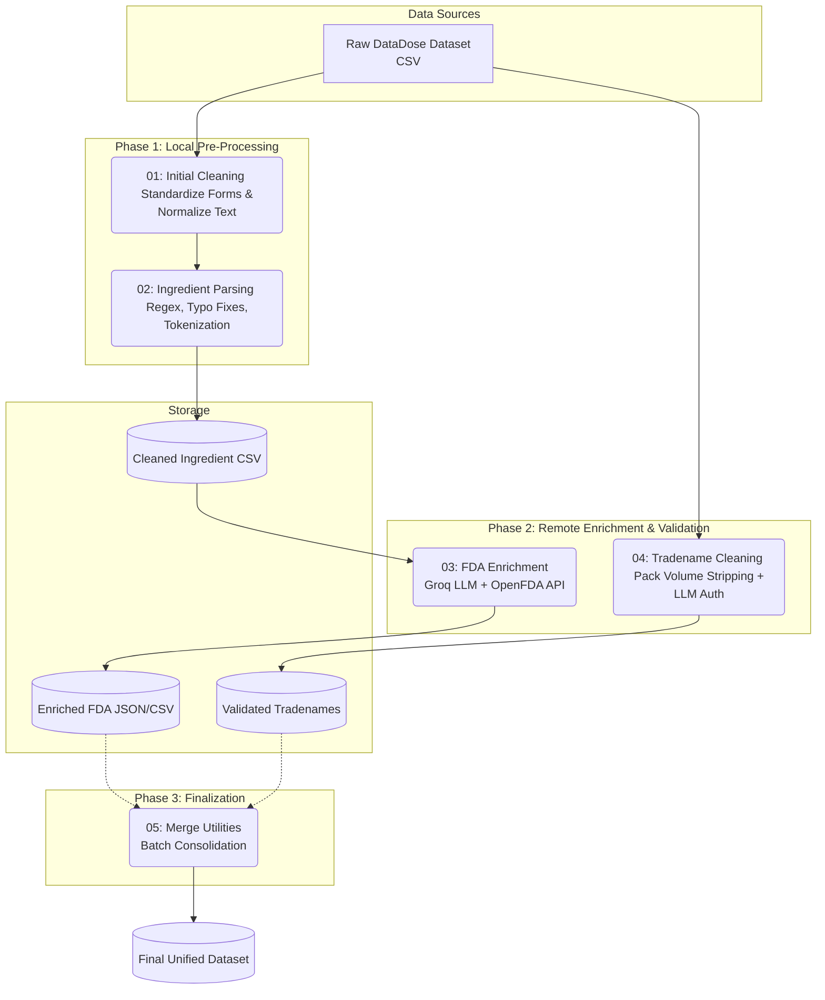

# DataDose Pipeline: Pharmaceutical Data Cleaning & FDA Enrichment

An automated Python-based data engineering pipeline designed to clean, canonicalize, and enrich raw, messy pharmaceutical datasets using a hybrid approach of deterministic parsing (Regex/NLP), Large Language Models (LLMs), and external federal APIs.


---

## Table of Contents
1. [Executive Summary](#executive-summary)
2. [Business Problem](#business-problem)
3. [Architecture & Workflow](#architecture--workflow)
4. [Deep Dive: Pipeline Stages](#deep-dive-pipeline-stages)
   - [Stage 1: Ingestion & Text Normalization](#stage-1-ingestion--text-normalization)
   - [Stage 2: Active Ingredient Validation](#stage-2-active-ingredient-validation)
   - [Stage 3: LLM & OpenFDA Enrichment](#stage-3-llm--openfda-enrichment)
   - [Stage 4: Tradename Sanitization](#stage-4-tradename-sanitization)
   - [Stage 5: Batch File Operations](#stage-5-batch-file-operations)
5. [Data Transformation Examples](#data-transformation-examples)
6. [Setup & Local Execution](#setup--local-execution)

---

## Executive Summary

The **DataDose Pipeline** is a sequential batch-processing system built across five dedicated Jupyter Notebooks. It ingests raw healthcare product inventory and outputs standardized, medically accurate master records. 

By combining fast, deterministic natural language processing (regex, tokenization, fuzzy matching) with state-of-the-art LLMs (`llama-3.1-8b-instant` via Groq) and the official OpenFDA API, this pipeline achieves production-grade canonicalization of active ingredients, standardized dosage forms, and pure brand names stripped of inventory noise.

* **Business Value:** Automates the massive manual curation overhead required to map disparate e-commerce or pharmacy point-of-sale data to standard clinical databases.
* **Technical Value:** Demonstrates a highly resilient text-processing architecture that utilizes cost-effective regex for 80% of the cleaning, falling back to semantic LLM evaluation only for complex, ambiguous pharmaceutical nomenclature.

---

## Business Problem

Healthcare and pharmacy datasets are notoriously dirty. Data sourced from point-of-sale systems, scraping, or disparate hospital databases typically suffer from:
* **Concatenated Inventory Noise:** Tradenames are heavily polluted with package sizes, volume counts, and dosage forms (e.g., *"Aspirin 500mg Tablet 20 tabs"* instead of just *"Aspirin"*).
* **Non-Standard Ingredients:** Active pharmaceutical ingredients (APIs) contain misspellings (e.g., *"nitrofurantion"*), local synonyms, or system-encoded tokens (e.g., *"__ING0024__"*).
* **Unstructured Formats:** Dosage forms exist as dozens of free-text variations (*"f.c.tabs"*, *"caps"*, *"cre"*) making aggregations impossible.
* **Lack of Master Data:** It is difficult to separate non-pharmaceutical items (cosmetics, supplements) from regulated prescription and OTC drugs without manual clinical review.

---

## Architecture & Workflow

The pipeline operates as a sequential Directed Acyclic Graph (DAG) executed via notebook environments, processing CSV files sequentially.



---

## Deep Dive: Pipeline Stages

### Stage 1: Ingestion & Text Normalization
**File:** `01_DataDose_Initial_Cleaning.ipynb`

This stage acts as the ingestion layer, standardizing the base schema of the CSV.
* **Feature Engineering:** Drops unused operational columns (`updated`, `created`, `new_price`, `id`, `Therapeutic_Group`) to reduce memory footprint.
* **String Normalization:** Applies vectorized `.astype(str).str.lower().str.strip()` to textual columns: `activeingredient`, `company`, `form`, `group`, `route`, and `tradename`.
* **Dosage Form Consolidation:** Uses a curated dictionary (`form_consolidation`) to collapse free-text into standardized medical categories. 
  * Fixes typos: `cre` $\rightarrow$ `cream`, `tabs.` $\rightarrow$ `tablet`, `power` $\rightarrow$ `powder`.
  * Categorizes: `ampoule/vial/syringe/pen` $\rightarrow$ `injection`.
  * Categorizes: `tablet/lozenges/film/effervescent` $\rightarrow$ `oral_solid`.
  * Categorizes: `syrup/suspension/solution/mouth wash` $\rightarrow$ `oral_liquid`.

### Stage 2: Active Ingredient Validation
**File:** `02_Active_Ingredient_Cleaning_and_Verification.ipynb`

Performs deep deterministic cleaning of complex chemical strings.
* **Token Decoding:** Function `decode_encoded_tokens()` replaces database artifact tokens (`__ING0024__` $\rightarrow$ `vita`, `__ING0055__` $\rightarrow$ `iron`).
* **Spell Correction:** Function `apply_spell_fix()` employs a custom dictionary correcting known systemic misspellings (e.g., `cholorohexidine` $\rightarrow$ `chlorhexidine`, `nitrofurantion` $\rightarrow$ `nitrofurantoin`).
* **Medical Expansion:** `PLAIN_REPLACEMENTS` and `BVITAMIN_REGEX` expand grouped terms into their chemical components. For example, `vitamin b complex` is translated via regex into `thiamine + riboflavin + niacin + pantothenic acid + pyridoxine + biotin + folic acid + cobalamin`.
* **Garbage & Unit Filtering:** Uses `DOSE_UNIT_PATTERN` regex to strip numeric weights and forms (`mg`, `mcg`, `iu`, `ml`, `%`). Filters out cosmetic terms (`shampoo`, `cream`, `lotion`) and non-drug tokens (`aloe vera`, `honey`, `royal jelly`).
* **Combination Sorting:** Splits multi-ingredient compounds by `+`, trims whitespace, removes duplicates, and sorts alphabetically to ensure canonical combination representation. 
* **Fuzzy Matching:** Includes a `fuzzy_match_ingredient()` fallback using `difflib.SequenceMatcher` (threshold `0.85`) against local reference lists.

### Stage 3: LLM & OpenFDA Enrichment
**File:** `03_FDA_Enrichment.ipynb`

Leverages API-driven data enrichment to determine true pharmaceutical validity.
* **LLM Inference (Groq):** Uses `llama-3.1-8b-instant` with a `0.1` temperature. The system prompt instructs the model to act as a "senior pharmaceutical scientist" to evaluate the cleaned ingredients. 
  * Rejects food, spices, and vague marketing terms.
  * Outputs strict JSON: `{"is_drug": true/false, "canonical_name": "WHO INN Standard"}`.
* **OpenFDA API Integration:** Function `query_openfda()` executes `GET` requests to `https://api.fda.gov/drug/label.json` using the LLM-provided canonical name (`active_ingredients.name:"{search_term}"`).
* **Metadata Extraction:** Parses the FDA JSON response to extract `brand_names`, `generic_names`, `manufacturers`, `dosage_forms`, and `warnings`. Generates `ingredients_fda_results.json`.

### Stage 4: Tradename Sanitization
**File:** `04_Tradename_Cleaning_and_Validation.ipynb`

Isolates pure product branding from messy inventory text.
* **Multi-Pass Regex Stripping (`clean_tradename_text`):**
  * `_DOSAGE_FORM_RE`: A highly verbose regex pattern that hunts and removes exhaustive string variations of forms (e.g., `f.c.tabs`, `film-coated-tabs`, `suppositories`, `pessaries`).
  * `_PACK_VOLUME_RE`: Strips physical counts and volumes (e.g., `\d+ ml`, `\d+ tabs`, `ampoules`, `sachets`).
  * `_LEADING_NUMBER_RE` & `_NUMBER_WORD_RE`: Clears leading catalog numbers and spelled-out quantities ("one", "two").
* **LLM Brand Authentication:** Validates the stripped string with Groq to confirm if it represents a recognized pharmaceutical brand, actively discarding generic names or medical devices. Only outputs records meeting `CONFIDENCE_THRESHOLD = 0.85`.

### Stage 5: Batch File Operations
**File:** `05_Merge_Utilities.ipynb`

Provides a helper library (`merge_csv_files`, `batch_merge_folders`) for handling distributed CSV outputs across pipeline stages.
* **Consolidation:** Uses Python's `glob` to detect all `*.csv` files in a target directory, bypassing files that match a `skip_pattern`. It leverages `pandas.concat(dfs, ignore_index=True)` to safely bind the DataFrames, logging skipped files and handling schema alignment, before exporting a unified master file.

---

## Data Transformation Examples

Here is how the pipeline transforms raw data across its stages:

| Feature | Raw Input (Dirty Data) | Pipeline Output (Clean Data) | Transformation Stage |
| :--- | :--- | :--- | :--- |
| **Tradename** | `Aspirin 500mg Tablet 20 tabs` | `Aspirin` | Notebook 04 (Regex Stripping) |
| **Tradename** | `Amoxicillin Capsule 250mg 30 caps` | `Amoxicillin` | Notebook 04 (Regex Stripping) |
| **Ingredient** | `__ING0024__ b complex + iron 350m` | `iron + thiamine + riboflavin + niacin + pantothenic acid + pyridoxine + biotin + folic acid + cobalamin` | Notebook 02 (Token Decode + Med Expansion + Alpha Sort) |
| **Ingredient** | `cholorohexidine 2% solution` | `chlorhexidine` | Notebook 02 (Typo Fix + Regex Unit Strip) |
| **Dosage Form** | `f.c. effervescent tabs.` | `oral_solid` | Notebook 01 (Categorical Mapping) |

---

## Setup & Local Execution

### Prerequisites
* Python 3.8+
* `pandas`, `numpy`, `requests`
* Jupyter Notebook or Google Colab environment.
* Valid API Keys configured at the top of notebooks `02`, `03`, and `04`:
  * `GROQ_API_KEYS` (Required for LLM validation)
  * `OPENFDA_API_KEY` (Optional, prevents rate-limiting on OpenFDA)

### Environment Configuration
All file I/O operations utilize a base directory variable. By default, this is configured for Google Colab. **You must update these path definitions** at the top of each script to match your local environment before running.

```python
# Example: Change this in notebooks to match your local setup
BASE_DIR = './data_payloads/' 
INPUT_FILE = os.path.join(BASE_DIR, 'DataDoseDataset.csv')
```

### Recommended Execution Order
To process a raw dataset from start to finish, execute the notebooks in the following order:
1. `01_DataDose_Initial_Cleaning.ipynb`
2. `02_Active_Ingredient_Cleaning_and_Verification.ipynb`
3. `03_FDA_Enrichment.ipynb`
4. `04_Tradename_Cleaning_and_Validation.ipynb` *(Run independently on post-cleaned data)*
5. `05_Merge_Utilities.ipynb` *(Use to combine batched outputs if processing in chunks)*

---

