<p align="center">
  
</p>

<div align="center">

<br/>

<p align="center">
  <strong>Streams prescription events off Aiven Kafka, enriches against a Neo4j drug-interaction graph,<br/>scores patient risk in real time, lands in Snowflake, and publishes back to Kafka — all from a single Databricks notebook.</strong>
</p>

<br/>

<p align="center">
  
  
  
  
  
  
  
</p>

<br/>

<table>
<tr>
  <td align="center"><br/><sub><b>main + dead-letter</b></sub></td>
  <td align="center"><br/><sub><b>isolated per stage</b></sub></td>
  <td align="center"><br/><sub><b>DataDose.out</b></sub></td>
  <td align="center"><br/><sub><b>no silent drops</b></sub></td>
</tr>
</table>

</div>


<a id="toc"></a>
<p align="center"></p>

<table><tr><td>

| Section | Section |
|---|---|
| ✨ [Features](#features) | ⚙️ [Configuration](#configuration) |
| 🛠️ [Tech Stack](#tech-stack) | 📦 [Module Details](#module-details) |
| 🏗️ [Architecture](#architecture) | 🆕 [Recent Changes](#recent-changes) |
| 📁 [Folder Structure](#folder-structure) | ⚠️ [Known Limitations](#known-limitations) |
| ⚠️ [Prerequisites](#prerequisites) | 🤝 [Contributing](#contributing) |
| 🚀 [Installation](#installation) | 📄 [License](#license) |
| 📖 [Usage](#usage) | |

</td></tr></table>


<a id="features"></a>
<p align="center"></p>

<table>
<tr>
<td width="50%" valign="top">

#### 📡 Streaming Ingestion
- Consumes JSON prescription events from `DataDose.in` over `SASL_SSL` with `SCRAM-SHA-256` auth and a PEM-based SSL truststore
- Structured Streaming reader with a 10-second micro-batch trigger and a durable DBFS checkpoint
- Explicit `prescription_schema` — no `inferSchema`

#### 🛡️ Malformed Record Handling
- Records failing schema parsing are split into `malformed_df` instead of flowing into enrichment as nulls
- A second, independent streaming query drains `malformed_df` into the dead-letter table with its own checkpoint — parse failures are never silently dropped

#### 🕸️ Graph-Based Drug Safety Checks
- Looks up `Drug` nodes and `INTERACTS_WITH` relationships in Neo4j AuraDB, severity ranked `Major` → `Moderate` → `Minor`
- Cross-references `HAS_INGREDIENT` relationships to catch shared active ingredients

</td>
<td width="50%" valign="top">

#### ⚡ Real-Time Risk Scoring
- `DRUG_RISK_SCORE` from interaction severity, interaction count, ingredient overlap, and a polypharmacy flag (≥5 concurrent medications)
- Age-adjusted `PATIENT_RISK_SCORE`, with `HIGH_RISK_PATIENT` flagged at score ≥ 60

#### 🔀 Dual Sink
- Enriched rows written to `Snowflake STAGING.STG_TRANSACTION` (append) **and** published to `DataDose.out` for downstream consumers (Power BI, dashboards)

#### 🔒 Failure Isolation
- Per-row try/except in enrichment — one bad record cannot kill the micro-batch
- Snowflake write failures and Kafka-out write failures are caught independently
- All four failure types (`schema_parse_failed`, `enrichment_failed`, `snowflake_write_failed`, `kafka_out_write_failed`) route to a Delta dead-letter table with `FAILURE_REASON`, `BATCH_ID`, `FAILED_AT`, `RECORD` columns
- `BATCH_ID` derived from the Kafka offset range — checkpoint replays are identifiable downstream

</td>
</tr>
</table>

<p align="right"><sub><a href="#toc">↑ back to top</a></sub></p>


<a id="tech-stack"></a>
<p align="center"></p>

| Category | Technology | Notes |
|---|---|---|
| Compute | Databricks notebook | Assumes a pre-existing `spark` session |
| Streaming engine | PySpark Structured Streaming | `foreachBatch` micro-batch, two concurrent queries |
| Message broker | Aiven Kafka | `spark-sql-kafka` connector, SASL/SCRAM-SHA-256 over SSL |
| Graph database | Neo4j AuraDB | Official `neo4j` Python driver |
| Data warehouse | Snowflake | `net.snowflake.spark.snowflake` Spark connector |
| Dead-letter storage | Delta Lake | Native Databricks table format, queryable via SQL |
| Secrets | Databricks secret scope (`datadose`) | Required — no hardcoded fallback |
| Language | Python 3 | Runs inside the Databricks notebook runtime |

<p align="right"><sub><a href="#toc">↑ back to top</a></sub></p>


<a id="architecture"></a>
<p align="center"></p>

```
Aiven Kafka topic (DataDose.in)
        │  JSON prescription events
        ▼
Spark Structured Streaming reader ──► from_json (prescription_schema)
        │
        ├──► parse succeeds ──► parsed_df ──────────────────┐
        │                                                    │
        └──► parse fails ────► malformed_df                  │
                 │                                           ▼
     write_malformed_batch                   foreachBatch(process_batch)
                 │                                    │
                 │                         ┌──────────┴──────────┐
                 │                         │                      │
                 │                  Neo4j AuraDB           Risk scoring
                 │              (check_interactions)   (drug/patient scores)
                 │                         │                      │
                 │                         ▼                      ▼
                 │                    Snowflake            DataDose.out
                 │               STAGING.STG_TRANSACTION   (Kafka topic)
                 │                         │                      │
                 └─────────────────────────┴──────────────────────┘
                                           │
                               any failure at any stage
                                           ▼
                         Delta dead-letter table (DEAD_LETTER_PATH)
                      FAILURE_REASON: schema_parse_failed |
                      enrichment_failed | snowflake_write_failed |
                      kafka_out_write_failed
```

Two streaming queries run concurrently: the **main pipeline** (`query`) and the **dead-letter stream** for malformed records (`malformed_query`). Both checkpoint independently and both must be started and stopped together.

<p align="right"><sub><a href="#toc">↑ back to top</a></sub></p>


<a id="folder-structure"></a>
<p align="center"></p>

```
.
├── DataBricks_Pyspark.ipynb   # End-to-end notebook
└── README.md
```

> The notebook is self-contained — no separate `src/` package. All configuration, helper functions, and the streaming job live in one `.ipynb`.

<p align="right"><sub><a href="#toc">↑ back to top</a></sub></p>


<a id="prerequisites"></a>
<p align="center"></p>

1. **Databricks workspace** with a cluster running the following JARs:
   - `spark-sql-kafka` (matching your Spark/Scala version)
   - `snowflake-spark-connector`
2. **Aiven Kafka** with `DataDose.in` and `DataDose.out` topics, SCRAM-SHA-256 credentials, and `ca.pem` uploaded to a Workspace path
3. **Neo4j AuraDB** pre-loaded with `Drug`/`Ingredient` nodes and `INTERACTS_WITH`/`HAS_INGREDIENT` relationships
4. **Snowflake** account with a `STAGING.STG_TRANSACTION` table and write access
5. **Databricks secret scope named `datadose`** holding `kafka-username`, `kafka-password`, `neo4j-user`, `neo4j-password` (Snowflake creds in a separate `pharma-snowflake` scope) — credentials are **required**, no hardcoded fallback
6. A DBFS path for the dead-letter Delta table (default `dbfs:/pharma_pipeline/dead_letter`, auto-created on first write)
7. *(Optional, for testing)* `producer_simulator.py` producing messages onto `DataDose.in`

<p align="right"><sub><a href="#toc">↑ back to top</a></sub></p>


<a id="installation"></a>
<p align="center"></p>

1. **Upload the notebook:** `Workspace → Import → DataBricks_Pyspark.ipynb`
2. **Attach JARs** to the cluster (Cluster → Libraries → Install New):
   ```
   spark-sql-kafka    (matching your Spark version)
   snowflake-spark-connector
   ```
3. **Upload `ca.pem`** to a Workspace path, note it for `KAFKA_CA_PEM_PATH`
4. **Create the secret scope and required secrets:**
   ```bash
   databricks secrets create-scope datadose
   databricks secrets put-secret datadose kafka-username
   databricks secrets put-secret datadose kafka-password
   databricks secrets put-secret datadose neo4j-user
   databricks secrets put-secret datadose neo4j-password
   ```
5. **Run the notebook top to bottom**, each Step cell followed by its Debug cell(s) — see [Usage](#usage)

<p align="right"><sub><a href="#toc">↑ back to top</a></sub></p>


<a id="usage"></a>
<p align="center"></p>

#### Run the Pipeline Step by Step

```text
Step 0  → Install neo4j Python driver
Step 1  → Load credentials/config from secret scope; Debug 1 confirms masked values
Step 2  → Verify ca.pem, copy to /tmp/ca.pem; Debug 2
Step 3  → Define Neo4j driver + check_interactions(); Debug 3a/3b/3c
Step 4  → Test Snowflake connection + verify STG_TRANSACTION schema; Debug 4a/4b
Step 5  → Define kafka_stream_df; Debug 5a/5b
Step 6  → Define prescription_schema, parsed_df, malformed_df; Debug 6a/6b
Step 7  → Define process_batch() and write_dead_letter(); Debug 7 (dry-run)
Step 8  → Start the main streaming query (query = ...)
Step 8b → Start the dead-letter stream for malformed records (malformed_query = ...)
Step 9  → Monitor with Debug 8a–8d, then stop both queries when done
```

#### Inspect an Enrichment Result Directly

```python
result = check_interactions(
    new_drug="warfarin",
    current_drugs=["aspirin", "ibuprofen", "metformin"],
)
# result → dict with interaction_found, interaction_count,
#           interacting_drugs, interaction_severity,
#           interaction_type, shared_ingredient, ingredient_overlap_count
```

#### Monitor Both Streams

```python
print(f"Main pipeline running     : {query.isActive}")
print(f"Dead-letter stream running: {malformed_query.isActive}")
print(query.lastProgress)
```

#### Query the Dead-Letter Table

```python
try:
    dead_letter_df = spark.read.format('delta').load(DEAD_LETTER_PATH)
    dead_letter_df.groupBy('FAILURE_REASON').count().show()
except Exception as e:
    print(f"Nothing written yet or path doesn't exist: {e}")
```

#### Stop the Pipeline

```python
query.stop()
malformed_query.stop()
```

<p align="right"><sub><a href="#toc">↑ back to top</a></sub></p>


<a id="configuration"></a>
<p align="center"></p>

Resolved through `get_env()` (plain env var with default) or `get_secret_or_env()` (env var first, falling back to the `datadose` secret scope, `required=True` with no default for credentials).

| Variable | Required | Default | Description |
|---|---|---|---|
| `KAFKA_BOOTSTRAP_SERVERS` | No | `datadosekafka-901-...l.aivencloud.com:15816` | Aiven Kafka bootstrap host:port |
| `KAFKA_TOPIC` | No | `DataDose.in` | Input topic |
| `KAFKA_TOPIC_OUT` | No | `DataDose.out` | Output topic for enriched records |
| `KAFKA_GROUP_ID` | No | `PySparkDataBricks-group` | Informational only — Structured Streaming manages offsets via checkpoint |
| `KAFKA_USERNAME` | Yes (secret: `kafka-username`) | — | SCRAM-SHA-256 username |
| `KAFKA_PASSWORD` | Yes (secret: `kafka-password`) | — | SCRAM-SHA-256 password |
| `KAFKA_CA_PEM_PATH` | Yes | — | Workspace path to the Aiven CA certificate |
| `DEAD_LETTER_PATH` | No | `dbfs:/pharma_pipeline/dead_letter` | Delta table path for failed records |
| `NEO4J_URI` | Yes | — | Neo4j AuraDB URI (`neo4j+s://...`) |
| `NEO4J_USER` | Yes (secret: `neo4j-user`) | — | Neo4j username |
| `NEO4J_PASSWORD` | Yes (secret: `neo4j-password`) | — | Neo4j password |
| `SNOWFLAKE_URL` | Yes | — | Snowflake account URL |
| `SNOWFLAKE_USER` | Yes (secret: `snowflake-user`) | — | Snowflake username |
| `SNOWFLAKE_PASSWORD` | Yes (secret: `snowflake-password`) | — | Snowflake password |
| `SNOWFLAKE_DATABASE` | No | `PHARMA_ANALYTICS_DB` | Target database |
| `SNOWFLAKE_SCHEMA` | No | `STAGING` | Target schema |
| `SNOWFLAKE_WAREHOUSE` | No | `PHARMA_WH` | Snowflake warehouse |
| `SNOWFLAKE_ROLE` | No | `PYSPARK_ROLE` | Snowflake role used for writes |

**Risk-scoring constants** (hard-coded in `process_batch`, Step 7):

| Constant | Value | Used for |
|---|---|---|
| Severity weight — Major | `40` | Base of `drug_risk_score` |
| Severity weight — Moderate | `20` | Base of `drug_risk_score` |
| Severity weight — Minor | `10` | Base of `drug_risk_score` |
| Polypharmacy threshold | `≥ 5` current meds | Adds `+5` to `drug_risk_score`; sets `POLYPHARMACY_FLAG` |
| Age multiplier | `1.0 + (age - 40) × 0.005` | Scales `drug_risk_score` → `patient_risk_score` |
| High-risk threshold | `patient_risk_score ≥ 60` | Sets `HIGH_RISK_PATIENT` |

<p align="right"><sub><a href="#toc">↑ back to top</a></sub></p>


<a id="module-details"></a>
<p align="center"></p>

<details open>
<summary><b>📓 <code>DataBricks_Pyspark.ipynb</code> — Component Reference</b></summary>
<br/>

| Component | Description |
|---|---|
| `get_env()`, `get_secret_or_env()` | Config/secret resolution (Step 1) |
| `get_neo4j_driver()`, `check_interactions()` | Neo4j enrichment (Step 3) |
| `kafka_stream_df` | Structured Streaming Kafka reader (Step 5) |
| `prescription_schema`, `parsed_df`, `malformed_df` | JSON schema, valid stream, and split-out parse failures (Step 6) |
| `process_batch(batch_df, batch_id)` | Per-micro-batch enrichment, scoring, Snowflake write, `DataDose.out` write, dead-letter routing on failure (Step 7) |
| `write_dead_letter(records, reason, batch_id)` | Appends failed records to the Delta dead-letter table; never raises itself |
| `write_malformed_batch(batch_df, batch_id)` | Drains `malformed_df` into the dead-letter table (Step 8b) |
| `query` | Main pipeline `writeStream` handle (Step 8) |
| `malformed_query` | Dead-letter `writeStream` handle for parse failures (Step 8b) |

**Notes:**
- `process_batch` calls `batch_df.collect()` — pulls each micro-batch fully onto the driver before enrichment; see [Known Limitations](#known-limitations)
- `BATCH_ID` is `KAFKA-{batch_id}-{min_offset}-{max_offset}`, not a random UUID
- A dead-letter write failure is logged and printed, not raised, so it can't compound an existing failure

</details>

<p align="right"><sub><a href="#toc">↑ back to top</a></sub></p>


<a id="recent-changes"></a>
<p align="center"></p>

- Added the missing `DataDose.out` write — enriched rows now publish to Kafka in addition to Snowflake
- Added `malformed_df`: records failing schema parsing are split out and drained by a dedicated streaming query (Step 8b) into the dead-letter table
- Added per-row try/except in `process_batch` — one bad row no longer kills the micro-batch
- Wrapped Snowflake write and `DataDose.out` write in independent try/except blocks
- Added `write_dead_letter()` and a Delta dead-letter table capturing all four failure types with `FAILURE_REASON`, `BATCH_ID`, `FAILED_AT`, `RECORD` columns
- `BATCH_ID` changed from a random UUID to an offset-range-derived ID — checkpoint replays are identifiable
- Checkpoint path moved to a clearer durable path (off `/tmp`-prefixed name)
- Removed hardcoded credential fallback from Step 1 — `KAFKA_USERNAME`/`KAFKA_PASSWORD` now fail fast with `RuntimeError` if the `datadose` secret scope is not configured

<p align="right"><sub><a href="#toc">↑ back to top</a></sub></p>


<a id="known-limitations"></a>
<p align="center"></p>

- **Driver-side enrichment bottleneck:** `process_batch` collects each micro-batch to the driver and enriches row-by-row against Neo4j with two sequential Cypher queries per row — not parallelized across executors. Batching Neo4j lookups with `UNWIND` or moving enrichment to `mapPartitions` would remove this throughput ceiling at scale.
- **Dead-letter write failure = data loss:** A write failure that also fails to reach the dead-letter table results in real data loss (logged to notebook output, not persisted). Monitor for `DEAD LETTER WRITE ALSO FAILED` log lines.
- **`KAFKA_GROUP_ID` is informational only:** Structured Streaming manages offsets via its checkpoint, not Kafka consumer-group commits — this doesn't map directly onto a `PySparkDataBricks-group` ACL grant the way a traditional consumer would.

<p align="right"><sub><a href="#toc">↑ back to top</a></sub></p>


<a id="contributing"></a>
<p align="center"></p>

<div align="center">

1. Fork the repository
2. Create a feature branch (`git checkout -b feature/your-change`)
3. Commit your changes with a clear message
4. Push the branch and open a Pull Request describing what changed and why

</div>

<p align="right"><sub><a href="#toc">↑ back to top</a></sub></p>


<a id="license"></a>
<p align="center"></p>

<div align="center">

No `LICENSE` file is included. Add one (e.g. MIT, Apache 2.0) before distributing this project publicly.

</div>

<br/>

<div align="center">

*Databricks PySpark Streaming Pipeline — Kafka → PySpark → Neo4j → Snowflake*<br/>
*Part of the DataDose Clinical Decision Intelligence Platform*

<br/>

<a href="#toc"></a>

</div>
