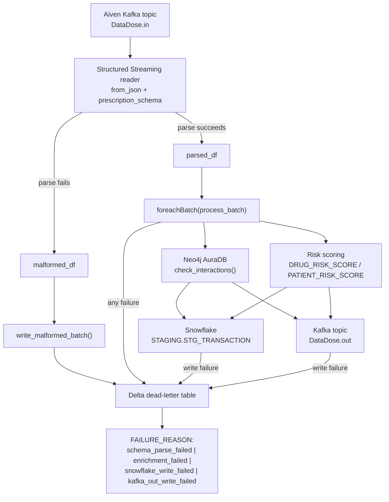

<div align="center">


# DataDose — Real-Time Prescription Safety Pipeline

**Kafka → PySpark → Neo4j → Snowflake → Kafka**, orchestrated from a single Databricks notebook.

[](#)
[](#)
[](#)
[](#)
[](#)
[](#)
[](#)
[](#license)

</div>


## Table of Contents

- [Overview](#overview)
- [Features](#features)
- [Architecture](#architecture)
- [Tech Stack](#tech-stack)
- [Folder Structure](#folder-structure)
- [Prerequisites](#prerequisites)
- [Installation](#installation)
- [Usage](#usage)
- [Configuration](#configuration)
- [Module Details](#module-details)
- [Recent Changes](#recent-changes)
- [Known Limitations](#known-limitations)
- [Roadmap](#roadmap)
- [Contributing](#contributing)
- [License](#license)


## Overview


DataDose streams prescription events off **Aiven Kafka**, enriches each record against a **Neo4j** drug-interaction graph, computes a real-time patient risk score, lands the enriched row in **Snowflake**, republishes it to a `DataDose.out` Kafka topic for downstream consumers (e.g. Power BI), and routes any failure — at any stage — to a **Delta dead-letter table** instead of dropping it.

The entire pipeline runs as two concurrent Structured Streaming queries inside a single Databricks notebook: the primary enrichment pipeline, and a dedicated stream that drains malformed records straight to the dead-letter table.

| | |
|---|---|
| **Trigger interval** | 10-second micro-batches |
| **Checkpointing** | Durable DBFS checkpoints, per query |
| **Failure handling** | Every failure type tagged and persisted, never silently dropped |
| **Sinks** | Snowflake (`STAGING.STG_TRANSACTION`) + Kafka (`DataDose.out`) |


## Features


**Streaming ingestion**
- Consumes JSON prescription events from `DataDose.in` over `SASL_SSL` with `SCRAM-SHA-256` auth and a PEM-based SSL truststore
- Explicit schema (`prescription_schema`) — no `inferSchema`
- 10-second micro-batch trigger with a durable DBFS checkpoint

**Malformed record handling**
- Records that fail schema parsing are split into `malformed_df` rather than flowing into enrichment as garbage
- A second, independent streaming query drains `malformed_df` into the dead-letter table with its own checkpoint

**Graph-based drug safety checks**
- Neo4j AuraDB lookups against `Drug` nodes and `INTERACTS_WITH` relationships, severity ranked `Major → Moderate → Minor`
- Cross-references `HAS_INGREDIENT` relationships to catch shared active ingredients

**Real-time risk scoring**
- `DRUG_RISK_SCORE` derived from interaction severity, interaction count, ingredient overlap, and a polypharmacy flag (≥ 5 concurrent medications)
- Age-adjusted `PATIENT_RISK_SCORE`, with `HIGH_RISK_PATIENT` flagged at score ≥ 60

**Dual sink**
- Enriched rows are appended to `Snowflake STAGING.STG_TRANSACTION` **and** published to `DataDose.out`

**Failure isolation**
- Per-row try/except during enrichment — one bad record no longer kills the micro-batch
- Snowflake and Kafka-out write failures are caught independently
- Every failure type is written to Delta with a `FAILURE_REASON` tag
- Batch IDs derive from the Kafka offset range, not a random UUID, so checkpoint replays are identifiable

**Built-in operational tooling**
- Numbered debug cells: masked-credential printouts, connectivity pings, schema checks, dry-runs, live stream monitoring


## Architecture




Two streaming queries run concurrently — the main pipeline (`query`) and the dead-letter stream for malformed records (`malformed_query`). Both checkpoint independently and both must be started and stopped together.


## Tech Stack


| Category | Technology | Notes |
|---|---|---|
| Compute | Databricks notebook | Assumes a pre-existing `spark` session |
| Streaming engine | PySpark Structured Streaming | `foreachBatch` micro-batch processing, two concurrent queries |
| Message broker | Aiven Kafka | `spark-sql-kafka` connector, SASL/SCRAM-SHA-256 over SSL |
| Graph database | Neo4j AuraDB | Official `neo4j` Python driver |
| Data warehouse | Snowflake | `net.snowflake.spark.snowflake` Spark connector |
| Dead-letter storage | Delta Lake | Native Databricks table format, queryable via SQL |
| Secrets | Databricks secret scope (`datadose`) | Required — no hardcoded fallback |
| Language | Python 3 | Runs inside the Databricks notebook runtime |


## Folder Structure


```
.
├── DataBricks_Pyspark.ipynb   # End-to-end notebook
└── README.md
```

The notebook is self-contained — no separate `src/` package.


## Prerequisites


1. **Databricks workspace** with a cluster running:
   - `spark-sql-kafka` (matching your Spark/Scala version)
   - `snowflake-spark-connector`
2. **Aiven Kafka** with `DataDose.in` and `DataDose.out` topics, SCRAM-SHA-256 credentials, and `ca.pem` uploaded to a Workspace path
3. **Neo4j AuraDB** pre-loaded with `Drug`/`Ingredient` nodes and `INTERACTS_WITH`/`HAS_INGREDIENT` relationships
4. **Snowflake** account with a `STAGING.STG_TRANSACTION` table and write access
5. **Databricks secret scope named `datadose`** holding `kafka-username`, `kafka-password`, `neo4j-user`, `neo4j-password` (Snowflake creds live in a separate `pharma-snowflake` scope) — credentials are required, there is no hardcoded fallback
6. A DBFS path for the dead-letter Delta table (default `dbfs:/pharma_pipeline/dead_letter`, auto-created on first write)
7. *(Optional, for testing)* `producer_simulator.py` producing messages onto `DataDose.in`


## Installation


1. Upload the notebook: `Workspace → Import → DataBricks_Pyspark.ipynb`
2. Attach `spark-sql-kafka` and `snowflake-spark-connector` to the cluster (`Cluster → Libraries → Install New`)
3. Upload `ca.pem` to a Workspace path, note it for `KAFKA_CA_PEM_PATH`
4. Create the secret scope and required secrets:

```bash
databricks secrets create-scope datadose
databricks secrets put-secret datadose kafka-username
databricks secrets put-secret datadose kafka-password
databricks secrets put-secret datadose neo4j-user
databricks secrets put-secret datadose neo4j-password
```

5. Run the notebook top to bottom, executing each Step cell followed by its Debug cell(s) — see [Usage](#usage)


## Usage


```text
Step 0  -> Install neo4j Python driver
Step 1  -> Load credentials/config from the secret scope; Debug 1 confirms masked values
Step 2  -> Verify ca.pem, copy to /tmp/ca.pem; Debug 2
Step 3  -> Define Neo4j driver + check_interactions(); Debug 3a/3b/3c
Step 4  -> Test Snowflake connection + verify STG_TRANSACTION schema; Debug 4a/4b
Step 5  -> Define kafka_stream_df; Debug 5a/5b
Step 6  -> Define prescription_schema, parsed_df, malformed_df; Debug 6a/6b
Step 7  -> Define process_batch() and write_dead_letter(); Debug 7 (dry-run)
Step 8  -> Start the main streaming query (query = ...)
Step 8b -> Start the dead-letter stream for malformed records (malformed_query = ...)
Step 9  -> Monitor with Debug 8a-8d, then stop both queries when done
```

### Inspecting an enrichment result directly

```python
result = check_interactions(
    new_drug="warfarin",
    current_drugs=["aspirin", "ibuprofen", "metformin"],
)
```

### Monitoring both streams

```python
print(f"Main pipeline running     : {query.isActive}")
print(f"Dead-letter stream running: {malformed_query.isActive}")
print(query.lastProgress)
```

### Checking the dead-letter table

```python
try:
    dead_letter_df = spark.read.format('delta').load(DEAD_LETTER_PATH)
    dead_letter_df.groupBy('FAILURE_REASON').count().show()
except Exception as e:
    print(f"Nothing written yet or path doesn't exist: {e}")
```

### Stopping the pipeline

```python
query.stop()
malformed_query.stop()
```


## Configuration


Resolved through `get_env()` (plain env var with default) or `get_secret_or_env()` (env var first, falling back to the `datadose` secret scope, `required=True` with no default for credentials).

| Variable | Required | Default | Description |
|---|---|---|---|
| `KAFKA_BOOTSTRAP_SERVERS` | No | `datadosekafka-901-datadosedepiproject001.l.aivencloud.com:15816` | Aiven Kafka bootstrap host:port |
| `KAFKA_TOPIC` | No | `DataDose.in` | Input topic |
| `KAFKA_TOPIC_OUT` | No | `DataDose.out` | Output topic for enriched records |
| `KAFKA_GROUP_ID` | No | `PySparkDataBricks-group` | Informational — Structured Streaming manages offsets via checkpoint, not this group |
| `KAFKA_USERNAME` | Yes (secret: `kafka-username`) | — | SCRAM-SHA-256 username |
| `KAFKA_PASSWORD` | Yes (secret: `kafka-password`) | — | SCRAM-SHA-256 password |
| `KAFKA_CA_PEM_PATH` | Yes | — | Workspace path to the Aiven CA certificate |
| `DEAD_LETTER_PATH` | No | `dbfs:/pharma_pipeline/dead_letter` | Delta table path for failed records |
| `NEO4J_URI` | Yes | — | Neo4j AuraDB connection URI (`neo4j+s://...`) |
| `NEO4J_USER` | Yes (secret: `neo4j-user`) | — | Neo4j username |
| `NEO4J_PASSWORD` | Yes (secret: `neo4j-password`) | — | Neo4j password |
| `SNOWFLAKE_URL` | Yes | — | Snowflake account URL |
| `SNOWFLAKE_USER` | Yes (secret: `snowflake-user`) | — | Snowflake username |
| `SNOWFLAKE_PASSWORD` | Yes (secret: `snowflake-password`) | — | Snowflake password |
| `SNOWFLAKE_DATABASE` | No | `PHARMA_ANALYTICS_DB` | Target database |
| `SNOWFLAKE_SCHEMA` | No | `STAGING` | Target schema |
| `SNOWFLAKE_WAREHOUSE` | No | `PHARMA_WH` | Snowflake warehouse |
| `SNOWFLAKE_ROLE` | No | `PYSPARK_ROLE` | Snowflake role used for writes |

### Risk-scoring constants

Hard-coded in `process_batch`, Step 7:

| Constant | Value | Used for |
|---|---|---|
| Severity weight — Major | `40` | Base of `drug_risk_score` |
| Severity weight — Moderate | `20` | Base of `drug_risk_score` |
| Severity weight — Minor | `10` | Base of `drug_risk_score` |
| Polypharmacy threshold | ≥ 5 current meds | Adds `+5` to `drug_risk_score`; sets `POLYPHARMACY_FLAG` |
| Age multiplier | `1.0 + (age - 40) * 0.005` | Scales `drug_risk_score` → `patient_risk_score` |
| High-risk threshold | `patient_risk_score >= 60` | Sets `HIGH_RISK_PATIENT` |


## Module Details


| Component | Description |
|---|---|
| `get_env()`, `get_secret_or_env()` | Config/secret resolution (Step 1) |
| `get_neo4j_driver()`, `check_interactions()` | Neo4j enrichment (Step 3) |
| `kafka_stream_df` | Structured Streaming Kafka reader (Step 5) |
| `prescription_schema`, `parsed_df`, `malformed_df` | JSON schema, valid stream, and split-out parse failures (Step 6) |
| `process_batch(batch_df, batch_id)` | Per-micro-batch enrichment, scoring, Snowflake write, `DataDose.out` write, dead-letter routing on failure (Step 7) |
| `write_dead_letter(records, reason, batch_id)` | Appends failed records to the Delta dead-letter table; never raises itself |
| `write_malformed_batch(batch_df, batch_id)` | Drains `malformed_df` into the dead-letter table (Step 8b) |
| `query` | Main pipeline `writeStream` handle (Step 8) |
| `malformed_query` | Dead-letter `writeStream` handle for parse failures (Step 8b) |

**Notes**
- `process_batch` calls `batch_df.collect()`, pulling each micro-batch fully onto the driver before enrichment — see [Known Limitations](#known-limitations)
- `BATCH_ID` is `KAFKA-{batch_id}-{min_offset}-{max_offset}`, not a random UUID
- A dead-letter write failure is logged and printed, not raised, so it can't compound an existing failure


## Recent Changes

- Added the missing `DataDose.out` write — enriched rows now publish to Kafka in addition to Snowflake
- Added `malformed_df`: records that fail schema parsing are split out instead of flowing into enrichment as nulls, drained by a dedicated streaming query (Step 8b) into the dead-letter table
- Added per-row try/except in `process_batch` — one bad row no longer kills the micro-batch
- Wrapped the Snowflake write and the `DataDose.out` write in independent try/except blocks
- Added `write_dead_letter()` and a Delta dead-letter table capturing all four failure types (`schema_parse_failed`, `enrichment_failed`, `snowflake_write_failed`, `kafka_out_write_failed`) with `FAILURE_REASON`, `BATCH_ID`, `FAILED_AT`, `RECORD` columns
- `BATCH_ID` changed from a random UUID to an offset-range-derived ID, so checkpoint replays are identifiable
- Checkpoint path moved off a `/tmp`-prefixed name to a clearer durable path
- Removed the hardcoded credential fallback from Step 1 — `KAFKA_USERNAME`/`KAFKA_PASSWORD` now fail fast with `RuntimeError` if the `datadose` secret scope isn't configured


## Known Limitations

- `process_batch` collects each micro-batch to the driver and enriches row-by-row against Neo4j with two sequential Cypher queries per row — not parallelized across executors, so this is the throughput ceiling at scale. Batching the Neo4j lookups with `UNWIND`, or moving enrichment to `mapPartitions`, would remove this bottleneck.
- A write failure that also fails to reach the dead-letter table results in real data loss (logged to notebook output, not persisted) — monitor for `DEAD LETTER WRITE ALSO FAILED` log lines.
- `KAFKA_GROUP_ID` is informational only; Structured Streaming manages offsets via its checkpoint, not Kafka consumer-group commits, so this doesn't map directly onto a `PySparkDataBricks-group` ACL grant the way a traditional consumer would.


## Roadmap


- [ ] Batch Neo4j lookups with `UNWIND` (or move enrichment to `mapPartitions`) to remove the per-row Cypher round-trip bottleneck
- [ ] Extract the notebook into a versioned `src/` package with unit tests
- [ ] Add a retry/backoff policy for transient Snowflake and Kafka-out write failures before falling back to the dead-letter table
- [ ] Add a LICENSE file


## Contributing


1. Fork the repository
2. Create a feature branch (`git checkout -b feature/your-change`)
3. Commit your changes with a clear message
4. Push the branch and open a Pull Request describing what changed and why


## License


No LICENSE file is currently included in this repository. Add one (e.g. MIT, Apache 2.0) before distributing this project publicly.

<div align="center">


Built with PySpark · Kafka · Neo4j · Snowflake · Delta Lake

</div>
