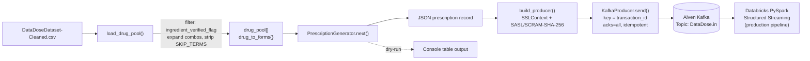

<div align="center">


# DataDose Producer Simulator

**A pharmacy prescription event generator streaming verified drug-INN data to Aiven Kafka over SASL_SSL** — the ingestion source for the DataDose real-time drug-interaction pipeline.

[](#tech-stack)
[](#architecture)
[](#security)
[](#security)
[](#tech-stack)
[](#features)
[](#license)

</div>


## Table of Contents

- [Overview](#overview)
- [Features](#features)
- [Architecture](#architecture)
- [Tech Stack](#tech-stack)
- [Folder Structure](#folder-structure)
- [Prerequisites](#prerequisites)
- [Installation](#installation)
- [Usage](#usage)
- [Configuration](#configuration)
- [Security](#security)
- [Module Details](#module-details)
- [Recent Changes](#recent-changes)
- [Known Limitations](#known-limitations)
- [Contributing](#contributing)
- [License](#license)


## Overview


`producer_simulator.py` generates realistic pharmacy prescription events from a verified drug-INN dataset and streams them as JSON messages to an Aiven Kafka topic (`DataDose.in`) over SASL_SSL. It is the upstream event source consumed by the DataDose PySpark streaming pipeline — every message this simulator emits is what `kafka_stream_df` reads on the other side.

| | |
|---|---|
| **Role in the system** | Upstream event producer for `DataDose.in` |
| **Input** | Verified drug dataset (CSV) |
| **Output** | Keyed JSON messages on Aiven Kafka |
| **Modes** | Live streaming, capped run (`--max`), dry-run (console only) |


## Features


**Producer Simulator**
- **Verified drug pool** — loads INNs from a CSV dataset, filters to `ingredient_verified_flag = TRUE` rows where present, expands combination products (`A | B | C` → individual names), and strips known non-drug terms (vitamins, oils, unknown entries)
- **Dataset-driven dosage forms** — `new_drug_form` is drawn from the actual `dosage_form` values observed per drug in the dataset, not a generic random pick; falls back to a fixed 13-value pool only when a drug has no recorded form
- **Realistic prescription generation** — randomizes transaction ID, patient ID, pharmacy (120 pharmacies), Egyptian city assignment, new drug, dose (value + unit), dose form, current medications (0–5), patient age (18–85), and gender
- **Keyed Kafka messages** — each message is sent with `transaction_id` as the Kafka key (previously sent with no key)
- **Configurable throughput** — `--rate` controls messages per second; `--max` stops after N messages
- **Dry-run mode** — `--dry-run` prints prescriptions to console without connecting to Kafka
- **Explicit SSL context** — works around a known `kafka-python` bug where `ssl_cafile=` silently fails for SASL_SSL, by building an `ssl.SSLContext` explicitly with TLS 1.2 minimum
- **Non-blocking delivery** — sends are asynchronous with an error callback instead of blocking on `future.get()` per message, so `linger_ms` batching actually takes effect
- **Reliable delivery** — `acks="all"` and `enable_idempotence=True` to avoid silent message loss or duplication on retry
- **Live progress reporting** — a formatted table row per message and a stats summary every 50 messages
- **Session summary** — on exit (Ctrl+C or max reached), prints total messages sent, errors, duration, average rate, and endpoint


## Architecture




```text
producer_simulator.py

  load_drug_pool(DATASET_PATH)
    - filter: ingredient_verified_flag = TRUE (if column present)
    - ingredient column: ingredient_corrected -> activeingredient_clean -> drug_ingredients
    - expand: "A | B" -> ["A", "B"]
    - build drug -> dosage_form[] mapping from the dosage_form column
    - deduplicate + sort -> drug_pool[], drug_to_forms{}

  PrescriptionGenerator(drug_pool, drug_to_forms)
    .next() -> {
      transaction_id, patient_id,
      pharmacy_id, pharmacy_city,
      new_drug, new_drug_dose,
      new_drug_form,        <- from drug_to_forms[new_drug], falls back to DOSE_FORMS
      current_drugs[], patient_age, patient_gender,
      timestamp
    }

  build_producer()
    ssl.SSLContext(ca.pem) + SASL/SCRAM-SHA-256
    acks="all", enable_idempotence=True
    -> KafkaProducer

  run(rate, dry_run, max_msgs)
    while True:
      generate -> serialize -> producer.send(TOPIC, key=transaction_id, value=record)
      (non-blocking, error handled via callback)

        |  JSON over SASL_SSL, keyed by transaction_id
        v
  Aiven Kafka - Topic: DataDose.in
        |
        v
  Databricks PySpark Structured Streaming (production pipeline)
```


## Tech Stack


| Category | Technology | Purpose |
|---|---|---|
| Language | Python 3.10+ | Core runtime |
| Kafka Client | `kafka-python` | Producer API |
| Data Processing | `pandas` | CSV dataset loading and INN/dosage-form extraction |
| Message Broker | Aiven Kafka | Target event stream |
| Auth Protocol | SASL/SCRAM-SHA-256 | Kafka authentication |
| Transport Security | TLS 1.2+ (`ca.pem`) | Encrypted broker connection |
| Serialization | JSON (UTF-8) | Message payload format |
| CLI | `argparse` | `--rate`, `--max`, `--dry-run` flags |


## Folder Structure


```
Kafka/
├── producer_simulator.py       # Producer — generates and streams prescription events
├── certs/
│   └── ca.pem                  # Aiven Kafka CA certificate
├── DataDoseDataset-Cleaned.csv # Verified drug dataset (path set in DATASET_PATH)
└── README.md
```


## Prerequisites


1. **Python 3.10+**
2. **pip packages** — `kafka-python`, `pandas`
3. **Aiven Kafka service** with a `DataDose.in` topic, SASL/SCRAM credentials, and `ca.pem`
4. **Drug dataset** with an ingredient column named one of `ingredient_corrected`, `activeingredient_clean`, or `drug_ingredients`, and ideally a `dosage_form` column for realistic form generation
5. Outbound TCP access to the Aiven bootstrap server (default port `15816`)


## Installation


```bash
pip install kafka-python pandas
```

Download `ca.pem` from **Aiven Dashboard → Your Kafka Service → Overview**, and place it wherever `KAFKA_CA_PEM_PATH` points.

Verify prescription generation without touching Kafka:

```bash
python producer_simulator.py --dry-run --max 5
```

Expected output:

```text
Loading dataset: DataDoseDataset-Cleaned.csv
Using ingredient column: drug_ingredients
Unique drug INNs: X,XXX
Drugs with a known dosage_form: X,XXX / X,XXX

TX ID       Pharmacy    City                    New Drug                      Current Meds
----------  ----------  ----------------------  ----------------------------  ------------------------------
123456      PHX_042     Cairo                   paracetamol                   aspirin, metformin
```


## Usage


```bash
# Default rate (1 msg/sec), runs until Ctrl+C
python producer_simulator.py

# Custom rate
python producer_simulator.py --rate 5

# Fixed message count
python producer_simulator.py --rate 10 --max 500

# Dry run, no Kafka connection
python producer_simulator.py --dry-run --max 10
```

Session summary on exit:

```text
-------------------------------------------------------
SESSION SUMMARY
-------------------------------------------------------
Messages sent: 250
Errors: 0
Duration: 50.2s
Avg rate: 4.98 msg/s
Kafka topic: DataDose.in
Endpoint: datadosekafka-901-datadosedepiproject001.l.aivencloud.com:15816
-------------------------------------------------------
```


## Configuration


`get_env()` resolves config from environment variables with a fallback default. `KAFKA_USERNAME`, `KAFKA_PASSWORD`, and `DATASET_PATH` currently ship with in-file defaults for local development speed — see [Security](#security) for the tradeoff this implies.

| Variable | Default | Description |
|---|---|---|
| `KAFKA_BOOTSTRAP_SERVERS` | `datadosekafka-901-datadosedepiproject001.l.aivencloud.com:15816` | Aiven Kafka bootstrap host:port |
| `KAFKA_USERNAME` | in-file default | Aiven Kafka SASL username — override via env var |
| `KAFKA_PASSWORD` | in-file default | Aiven Kafka SASL password — override via env var |
| `KAFKA_SASL_MECHANISM` | `SCRAM-SHA-256` | SASL mechanism |
| `KAFKA_TOPIC` | `DataDose.in` | Target Kafka topic |
| `KAFKA_CA_PEM_PATH` | `certs/ca.pem` (relative to script) | Path to the Aiven CA certificate |
| `DATASET_PATH` | `F:\DataDose\DataDose\Data\DataDoseDataset-Cleaned.csv` (hardcoded) | Path to the verified drug dataset |

### Simulation Parameters

| Constant | Value | Description |
|---|---|---|
| `RATE_PER_SECOND` | `1` | Default messages per second |
| `NUM_PHARMACIES` | `120` | Pharmacy pool size |
| `NUM_PATIENTS` | `50,000` | Patient ID range |
| `MAX_CURRENT_MEDS` | `5` | Max concurrent medications per prescription |
| `EGYPT_CITIES` | 25 cities | City pool |
| `DOSE_VALUES` | 15 values | Dose amount pool |
| `DOSE_UNITS` | 6 units | mg, mcg, g, mg/ml, IU, % |
| `DOSE_FORMS` (fallback only) | 13 forms | cream, drops, gel, injection, oral_liquid, capsule, tablet, ointment, lotion, powder, sachet, spray, suppository |

### CLI Flags

| Flag | Short | Default | Description |
|---|---|---|---|
| `--rate` | `-r` | `1.0` | Prescriptions per second |
| `--max` | `-m` | `None` | Stop after N messages |
| `--dry-run` | — | `False` | Console output only, no Kafka connection |


## Security


- **Authentication** — SASL/SCRAM-SHA-256 against Aiven Kafka
- **Transport** — TLS 1.2 minimum, enforced explicitly on the producer's `ssl.SSLContext` (works around a `kafka-python` bug where `ssl_cafile=` silently fails under SASL_SSL)
- **Trust anchor** — CA certificate loaded from `ca.pem`, downloaded from the Aiven Dashboard
- **Credential resolution** — env vars first, in-file default only as a local-development fallback

> **⚠ Rotate before sharing.** The current default `KAFKA_USERNAME` / `KAFKA_PASSWORD` values in `producer_simulator.py` are live Aiven credentials. Rotate them in the Aiven Dashboard before this file is shared or committed anywhere outside a private, access-controlled location, and set the env vars explicitly rather than relying on the in-file default once past local dev.


## Module Details


| Function / Class | Description |
|---|---|
| `get_env(name, default, required)` | Resolves config from environment variables |
| `load_drug_pool(csv_path)` | Reads the dataset, resolves the ingredient column (3-way fallback), filters verified rows if flagged, expands combination drugs, builds `drug_to_forms`, returns `(drug_pool, drug_to_forms)` |
| `PrescriptionGenerator.__init__(drugs, drug_to_forms)` | Seeds pharmacy pool and dosage-form lookup |
| `PrescriptionGenerator.next()` | Returns one prescription dict, using the real dataset dosage form for the chosen drug when available |
| `build_producer()` | Creates the SSL context, connects `KafkaProducer` with `acks="all"`, `enable_idempotence=True`, SASL/SCRAM-SHA-256 |
| `run(rate, dry_run, max_msgs)` | Main loop — generates, sends asynchronously keyed by `transaction_id`, logs progress, prints session summary |

**Notes**
- `producer.flush()` and `producer.close()` run in the `finally` block to ensure buffered messages are delivered before exit
- Delivery failures are reported via an error callback (`add_errback`), not a blocking `future.get()`
- `SKIP_TERMS` excludes non-drug entries (vitamins, oils, unknowns) from the pool


## Recent Changes

- Added `acks="all"` and `enable_idempotence=True` to prevent silent loss/duplication on retry
- Replaced blocking `future.get(timeout=10)` per-message send with a non-blocking send + error callback, so `linger_ms` batching works as intended
- Added `key_serializer` — messages now send `transaction_id` as the Kafka key (was previously unkeyed)
- `load_drug_pool` now falls back through `ingredient_corrected` → `activeingredient_clean` → `drug_ingredients` and raises a clear error listing available columns if none match, instead of a raw `KeyError`
- `load_drug_pool` now also builds a per-drug dosage-form mapping from the dataset's `dosage_form` column; `new_drug_form` uses the real value for that drug instead of a random pick from a fixed list
- `DOSE_FORMS` fallback list updated to the 13 real dosage forms present in the current dataset
- `DATASET_PATH` updated to point at `DataDoseDataset-Cleaned.csv`


## Known Limitations

- `DATASET_PATH` ships with a hardcoded Windows path (`F:\DataDose\...`) as its default — set the env var explicitly on any other machine
- `KAFKA_USERNAME` / `KAFKA_PASSWORD` in-file defaults are live credentials; see [Security](#security)
- No automated tests are documented for `load_drug_pool` or `PrescriptionGenerator` — validate with `--dry-run` after any dataset or schema change


## Contributing


1. Fork the repository
2. Create a feature branch: `git checkout -b feature/your-feature-name`
3. Commit your changes
4. Open a Pull Request describing the change and testing performed

Run `python producer_simulator.py --dry-run --max 20` before submitting. **Do not commit real Kafka credentials.**


## License


See `LICENSE` file for details.

<div align="center">


Part of the DataDose pipeline · Producer → Aiven Kafka → PySpark Structured Streaming

</div>
