<p align="center">
  
</p>

<div align="center">

<br/>

<p align="center">
  <strong>A realistic pharmacy prescription event simulator that streams verified drug INN data<br/>as JSON messages to Aiven Kafka over SASL_SSL, powering the DataDose real-time pipeline.</strong>
</p>

<br/>

<p align="center">
  
  
  
  
  
  
</p>

<br/>

<table>
<tr>
  <td align="center"><br/><sub><b>Pharmacy pool</b></sub></td>
  <td align="center"><br/><sub><b>Patient ID range</b></sub></td>
  <td align="center"><br/><sub><b>Real values per drug</b></sub></td>
  <td align="center"><br/><sub><b>No silent loss</b></sub></td>
</tr>
</table>

</div>


<a id="toc"></a>
<p align="center"></p>

<table><tr><td>

| Section | Section |
|---|---|
| ✨ [Features](#features) | ⚙️ [Configuration](#configuration) |
| 🛠️ [Tech Stack](#tech-stack) | 📦 [Module Details](#module-details) |
| 🏗️ [Architecture](#architecture) | 🆕 [Recent Changes](#recent-changes) |
| 📁 [Folder Structure](#folder-structure) | 🤝 [Contributing](#contributing) |
| ⚠️ [Prerequisites](#prerequisites) | 📄 [License](#license) |
| 🚀 [Installation](#installation) | |
| 📖 [Usage](#usage) | |

</td></tr></table>


<a id="features"></a>
<p align="center"></p>

<table>
<tr>
<td width="50%" valign="top">

#### 🧬 Producer Simulator

- **Verified drug pool** — loads INNs from a CSV dataset, filters to `ingredient_verified_flag = TRUE` rows, expands combination products (`A | B | C` → individual names), and strips known non-drug terms
- **Dataset-driven dosage forms** — `new_drug_form` drawn from the actual `dosage_form` values per drug in the dataset; falls back to a fixed 13-value pool only when a drug has no recorded form
- **Realistic prescription generation** — randomizes transaction ID, patient ID, pharmacy (120 pharmacies), Egyptian city, new drug, dose (value + unit), dose form, current medications (0–5), patient age (18–85), and gender
- **Keyed Kafka messages** — each message sent with `transaction_id` as the Kafka key
- **Configurable throughput** — `--rate` flag controls messages per second; `--max` stops after N messages
- **Dry-run mode** — `--dry-run` prints prescriptions to console without connecting to Kafka
- **Live progress reporting** — formatted table row per message, stats summary every 50 messages
- **Session summary** — on exit: total messages sent, errors, duration, avg rate, endpoint

</td>
<td width="50%" valign="top">

#### 🔐 Security & Reliability

- SASL/SCRAM-SHA-256 authentication against Aiven Kafka
- **TLS 1.2 minimum** enforced via explicit `ssl.SSLContext` — works around a known `kafka-python` bug where `ssl_cafile=` silently fails for SASL_SSL
- CA certificate loaded from `ca.pem` downloaded from the Aiven Dashboard
- **Non-blocking delivery** — sends are asynchronous with an error callback instead of blocking on `future.get()` per message, so `linger_ms` batching actually takes effect
- **Reliable delivery** — `acks="all"` and `enable_idempotence=True` to avoid silent message loss or duplication on retry
- Credentials resolved from environment variables, with an in-file default as fallback for local development only — see [Configuration](#configuration) for the security tradeoff

</td>
</tr>
</table>

<p align="right"><sub><a href="#toc">↑ back to top</a></sub></p>


<a id="tech-stack"></a>
<p align="center"></p>

| Category | Technology | Purpose |
|---|---|---|
| Language | Python 3.10+ | Core runtime |
| Kafka Client | `kafka-python` | Producer API |
| Data Processing | `pandas` | CSV dataset loading, INN/dosage-form extraction |
| Message Broker | Aiven Kafka | Target event stream |
| Auth Protocol | SASL/SCRAM-SHA-256 | Kafka authentication |
| Transport Security | TLS 1.2+ (`ca.pem`) | Encrypted broker connection |
| Serialization | JSON (UTF-8) | Message payload format |
| CLI | `argparse` | `--rate`, `--max`, `--dry-run` flags |

<p align="right"><sub><a href="#toc">↑ back to top</a></sub></p>


<a id="architecture"></a>
<p align="center"></p>

```
producer_simulator.py

  load_drug_pool(DATASET_PATH)
    ├── filter: ingredient_verified_flag = TRUE (if column present)
    ├── ingredient column: ingredient_corrected → activeingredient_clean → drug_ingredients
    ├── expand: "A | B" → ["A", "B"]
    ├── build drug → dosage_form[] mapping from the dosage_form column
    └── deduplicate + sort → drug_pool[], drug_to_forms{}

  PrescriptionGenerator(drug_pool, drug_to_forms)
    .next() → {
      transaction_id, patient_id,
      pharmacy_id, pharmacy_city,
      new_drug, new_drug_dose,
      new_drug_form,        ← from drug_to_forms[new_drug], falls back to DOSE_FORMS
      current_drugs[], patient_age, patient_gender,
      timestamp
    }

  build_producer()
    ssl.SSLContext(ca.pem) + SASL/SCRAM-SHA-256
    acks="all", enable_idempotence=True
    → KafkaProducer

  run(rate, dry_run, max_msgs)
    while True:
      generate → serialize → producer.send(TOPIC, key=transaction_id, value=record)
      (non-blocking, error handled via callback)

        │  JSON over SASL_SSL, keyed by transaction_id
        ▼
  Aiven Kafka — Topic: DataDose.in
        │
        ▼
  Databricks PySpark Structured Streaming (production pipeline)
```

<p align="right"><sub><a href="#toc">↑ back to top</a></sub></p>


<a id="folder-structure"></a>
<p align="center"></p>

```
Kafka/
├── producer_simulator.py       # Producer — generates and streams prescription events
├── certs/
│   └── ca.pem                  # Aiven Kafka CA certificate
├── DataDoseDataset-Cleaned.csv # Verified drug dataset (path set in DATASET_PATH)
└── README.md                   # This file
```

<p align="right"><sub><a href="#toc">↑ back to top</a></sub></p>


<a id="prerequisites"></a>
<p align="center"></p>

1. **Python 3.10+**
2. **pip packages** — `kafka-python`, `pandas`
3. **Aiven Kafka service** with a `DataDose.in` topic, SASL/SCRAM credentials, and `ca.pem`
4. **Drug dataset** with an ingredient column named one of `ingredient_corrected`, `activeingredient_clean`, or `drug_ingredients`, and ideally a `dosage_form` column for realistic form generation
5. Outbound TCP access to the Aiven bootstrap server (default port `15816`)

<p align="right"><sub><a href="#toc">↑ back to top</a></sub></p>


<a id="installation"></a>
<p align="center"></p>

```bash
pip install kafka-python pandas
```

Download `ca.pem` from **Aiven Dashboard → Your Kafka Service → Overview**, place it wherever `KAFKA_CA_PEM_PATH` points.

Verify prescription generation without touching Kafka:

```bash
python producer_simulator.py --dry-run --max 5
```

Expected output:
```
Loading dataset: DataDoseDataset-Cleaned.csv
Using ingredient column: drug_ingredients
Unique drug INNs: X,XXX
Drugs with a known dosage_form: X,XXX / X,XXX

TX ID       Pharmacy    City                    New Drug                      Current Meds
----------  ----------  ----------------------  ----------------------------  ------------------------------
123456      PHX_042     Cairo                   paracetamol                   aspirin, metformin
```

<p align="right"><sub><a href="#toc">↑ back to top</a></sub></p>


<a id="usage"></a>
<p align="center"></p>

```bash
# Default rate (1 msg/sec), runs until Ctrl+C
python producer_simulator.py

# Custom rate
python producer_simulator.py --rate 5

# Fixed message count
python producer_simulator.py --rate 10 --max 500

# Dry run — no Kafka connection
python producer_simulator.py --dry-run --max 10
```

Session summary on exit:
```
-------------------------------------------------------
SESSION SUMMARY
-------------------------------------------------------
Messages sent: 250
Errors: 0
Duration: 50.2s
Avg rate: 4.98 msg/s
Kafka topic: DataDose.in
Endpoint: datadosekafka-901-...l.aivencloud.com:15816
-------------------------------------------------------
```

#### CLI Flags

| Flag | Short | Default | Description |
|---|---|---|---|
| `--rate` | `-r` | `1.0` | Prescriptions per second |
| `--max` | `-m` | `None` | Stop after N messages |
| `--dry-run` | — | `False` | Console output only, no Kafka connection |

<p align="right"><sub><a href="#toc">↑ back to top</a></sub></p>


<a id="configuration"></a>
<p align="center"></p>

`get_env()` resolves config from environment variables with a fallback default.

> **Security note:** the current default `KAFKA_USERNAME` / `KAFKA_PASSWORD` values in the file are live Aiven credentials. Rotate them in the Aiven Dashboard before this file is shared or committed anywhere outside a private, access-controlled location. Prefer setting the env vars over relying on the in-file default once past local dev.

| Variable | Default | Description |
|---|---|---|
| `KAFKA_BOOTSTRAP_SERVERS` | `datadosekafka-901-...l.aivencloud.com:15816` | Aiven Kafka bootstrap host:port |
| `KAFKA_USERNAME` | in-file default | Aiven Kafka SASL username — override via env var |
| `KAFKA_PASSWORD` | in-file default | Aiven Kafka SASL password — override via env var |
| `KAFKA_SASL_MECHANISM` | `SCRAM-SHA-256` | SASL mechanism |
| `KAFKA_TOPIC` | `DataDose.in` | Target Kafka topic |
| `KAFKA_CA_PEM_PATH` | `certs/ca.pem` (relative to script) | Path to Aiven CA certificate |
| `DATASET_PATH` | `F:\DataDose\...\DataDoseDataset-Cleaned.csv` | Path to the verified drug dataset |

#### Simulation Parameters

| Constant | Value | Description |
|---|---|---|
| `RATE_PER_SECOND` | `1` | Default messages per second |
| `NUM_PHARMACIES` | `120` | Pharmacy pool size |
| `NUM_PATIENTS` | `50,000` | Patient ID range |
| `MAX_CURRENT_MEDS` | `5` | Max concurrent medications per prescription |
| `EGYPT_CITIES` | 25 cities | City pool |
| `DOSE_VALUES` | 15 values | Dose amount pool |
| `DOSE_UNITS` | 6 units | mg, mcg, g, mg/ml, IU, % |
| `DOSE_FORMS` (fallback) | 13 forms | cream, drops, gel, injection, oral_liquid, capsule, tablet, ointment, lotion, powder, sachet, spray, suppository |

<p align="right"><sub><a href="#toc">↑ back to top</a></sub></p>


<a id="module-details"></a>
<p align="center"></p>

<details open>
<summary><b>📄 <code>producer_simulator.py</code> — Function Reference</b></summary>
<br/>

| Function / Class | Description |
|---|---|
| `get_env(name, default, required)` | Resolves config from environment variables |
| `load_drug_pool(csv_path)` | Reads the dataset, resolves ingredient column (3-way fallback), filters verified rows, expands combination drugs, builds `drug_to_forms`, returns `(drug_pool, drug_to_forms)` |
| `PrescriptionGenerator.__init__(drugs, drug_to_forms)` | Seeds pharmacy pool and dosage-form lookup |
| `PrescriptionGenerator.next()` | Returns one prescription dict using the real dataset dosage form for the chosen drug when available |
| `build_producer()` | Creates the SSL context, connects `KafkaProducer` with `acks="all"`, `enable_idempotence=True`, SASL/SCRAM-SHA-256 |
| `run(rate, dry_run, max_msgs)` | Main loop: generates, sends asynchronously keyed by `transaction_id`, logs progress, prints session summary |

**Notes:**
- `producer.flush()` and `producer.close()` run in the `finally` block to ensure buffered messages are delivered before exit
- Delivery failures are reported via an error callback (`add_errback`), not a blocking `future.get()`
- `SKIP_TERMS` excludes non-drug entries (vitamins, oils, unknowns) from the pool

</details>

<p align="right"><sub><a href="#toc">↑ back to top</a></sub></p>


<a id="recent-changes"></a>
<p align="center"></p>

- Added `acks="all"` and `enable_idempotence=True` to prevent silent loss/duplication on retry
- Replaced blocking `future.get(timeout=10)` per-message send with a non-blocking send + error callback, so `linger_ms` batching works as intended
- Added `key_serializer` and now send `transaction_id` as the Kafka message key (was previously unkeyed)
- `load_drug_pool` now falls back through `ingredient_corrected` → `activeingredient_clean` → `drug_ingredients` and raises a clear error listing available columns if none match, instead of a raw `KeyError`
- `load_drug_pool` now builds a per-drug dosage-form mapping from the dataset's `dosage_form` column; `new_drug_form` uses the real value for that drug instead of a random pick from a fixed list
- `DOSE_FORMS` fallback list updated to the 13 real dosage forms present in the current dataset
- `DATASET_PATH` updated to point at `DataDoseDataset-Cleaned.csv`

<p align="right"><sub><a href="#toc">↑ back to top</a></sub></p>


<a id="contributing"></a>
<p align="center"></p>

<div align="center">

1. Fork the repository
2. Create a feature branch: `git checkout -b feature/your-feature-name`
3. Commit your changes
4. Open a Pull Request describing the change and testing performed

Run `python producer_simulator.py --dry-run --max 20` before submitting.
**Do not commit real Kafka credentials.**

</div>

<p align="right"><sub><a href="#toc">↑ back to top</a></sub></p>


<a id="license"></a>
<p align="center"></p>

<div align="center">

See [LICENSE](LICENSE) file for details.

</div>

<br/>

<div align="center">

*Kafka Simulator — DataDose Pharmacy Prescription Event Producer*<br/>
*Part of the DataDose Clinical Decision Intelligence Platform*

<br/>

<a href="#toc"></a>

</div>
