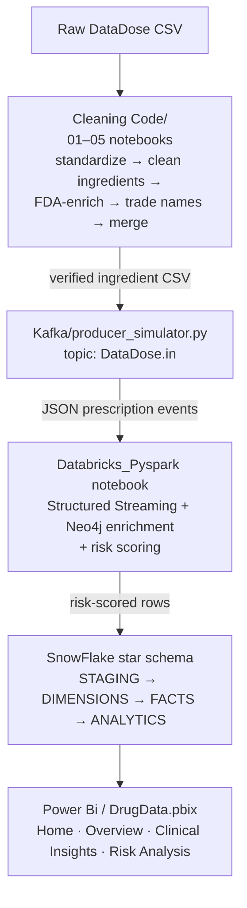
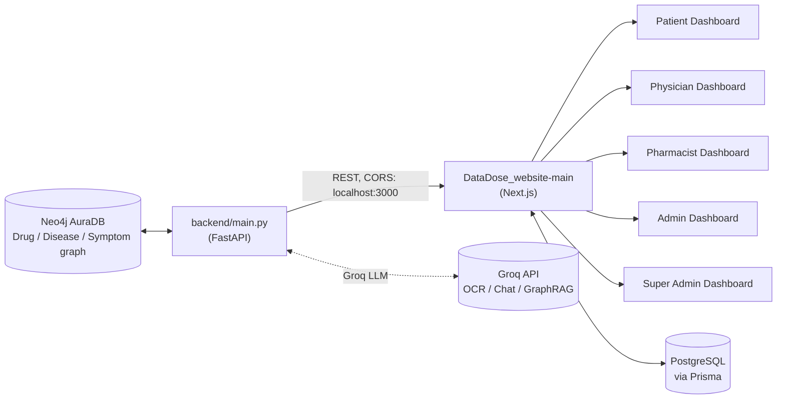

<p align="center">
  
</p>

<div align="center">

# Data Dose — Smart Clinical Decision Support Platform


> A full-stack Clinical Decision Support System that turns a Neo4j drug-interaction knowledge graph into real-time polypharmacy safety checks, served through a FastAPI backend and a role-based Next.js dashboard — backed by a complete data pipeline from raw pharmacy data to a Snowflake analytics warehouse and a four-page Power BI report.

</div>

---

## Table of Contents
- [Features](#features)
- [Tech Stack](#tech-stack)
- [Architecture](#architecture)
- [Folder Structure](#folder-structure)
- [Prerequisites](#prerequisites)
- [Installation](#installation)
- [Usage](#usage)
- [Configuration](#configuration)
- [API Reference](#api-reference)
- [Component Details](#component-details)
- [Power BI Report](#power-bi-report)
- [Project Documents](#project-documents)
- [Known Limitations](#known-limitations)
- [Contributing](#contributing)
- [License](#license)
- [Acknowledgments](#acknowledgments)
- [Contact](#contact)

---

## Features

<!-- <p align="center">
  
</p> -->

**Clinical decision support (frontend + backend)**
- N-degree polypharmacy scanner that checks all pairwise `INTERACTS_WITH` relationships among a patient's drug list
- Visual prescription map (React Flow) rendering drugs, diseases treated, and caused symptoms as a graph
- Smart alternative finder — suggests replacement drugs that treat the same disease without triggering known reactions or new interactions
- Reverse symptom tracer with multilingual/clinical synonym expansion (English + Arabic terms) to trace a symptom back to a suspect medication
- Prescription OCR scanner that extracts drug names from an uploaded prescription image via a vision LLM
- Hybrid GraphRAG chatbot and AI medical assistant that route a clinician's message through Neo4j first and fall back to an LLM for synthesis
- Role-based dashboards for Patient, Physician, Pharmacist, Admin, and Super Admin, with an approval workflow for new accounts

**Data pipeline (cleaning → enrichment → streaming → warehouse → BI)**
- Five-stage pandas pipeline that cleans raw drug records, normalizes active ingredients, verifies them against OpenFDA/Groq, and validates trade names
- Kafka producer/consumer simulators that stream synthetic prescription events over Aiven Kafka (SASL_SSL)
- Databricks PySpark Structured Streaming job that enriches each Kafka message against the Neo4j graph and writes risk-scored rows to Snowflake
- Full Snowflake star-schema DDL (staging, dimensions, facts, analytics) plus a Databricks↔Snowflake connection notebook
- A four-page Power BI report (`DrugData.pbix`) with custom HTML-driven visuals for reporting on top of the warehouse

---

## Tech Stack

| Layer | Technology | Purpose |
|---|---|---|
| Frontend | Next.js 15 (App Router), React 19, TypeScript | Role-based clinical dashboards |
| Frontend styling | Tailwind CSS v4, Framer Motion | Glassmorphism UI, animations |
| Frontend data viz | React Flow, Chart.js / react-chartjs-2, Recharts | Prescription graph map, analytics charts |
| Frontend auth/DB | NextAuth, Prisma ORM, PostgreSQL (`pg`), bcryptjs | Login, RBAC, EHR + prescription history |
| Backend API | FastAPI + Uvicorn (async) | REST endpoints for scan/alternatives/tracer/graph/OCR/chat |
| Graph database | Neo4j AuraDB (`neo4j+ssc://`) | Drug–Drug, Drug–Disease, Drug–Symptom knowledge graph |
| LLM | Groq (`llama-3.2-11b-vision-preview`, `llama3-8b-8192`) | OCR, chat routing/synthesis, GraphRAG |
| Data cleaning | pandas, numpy, difflib, regex | Ingredient/trade-name normalization & verification |
| Streaming | Aiven Kafka, `kafka-python` | Synthetic prescription event simulation |
| Stream processing | Databricks, PySpark Structured Streaming | Kafka → Neo4j enrichment → Snowflake writes |
| Data warehouse | Snowflake (`net.snowflake.spark.snowflake` connector) | Staging/dimension/fact/analytics tables |
| BI | Power BI (`DrugData.pbix`), custom "HTML Content" visual | Reporting dashboard on top of the warehouse |
| Testing | Playwright | E2E tests for prescription/auth/scanner flows |

---

## Architecture

### Data pipeline — raw data to BI report



### Live application — knowledge graph to dashboards



The repository contains **two largely independent halves**: a batch/streaming **data pipeline** that populates Snowflake and Power BI, and a **live application** (Next.js + FastAPI + Neo4j) that clinicians actually interact with. Both halves model the same drugs/diseases/symptoms conceptually, but the live application currently queries Neo4j only — it does not call into the Snowflake warehouse.

---

## Folder Structure

```
DataDose/
├── Cleaning Code/                     # 01–05 pandas notebooks: clean → verify → FDA-enrich → merge
├── Databricks_Pyspark/                # Kafka → Neo4j → Snowflake streaming notebook
├── Kafka/                             # producer_simulator.py, consumer_Simulator.py, certs/ca.pem
├── SnowFlake/
│   ├── Code/                          # DataDose-Schema.sql, snowflake_databricks-setup.sql,
│   │                                   # databricks_snowflake_Connection-_notebook.py
│   └── Document/                       # databricks_snowflake_connection-guide.docx,
│                                        # pharma_snowflake-schema.docx
├── Power Bi/
│   ├── DrugData.pbix                  # 4-page Power BI report (see Power BI Report section)
│   └── Icons and Background/          # 23 report image/icon assets
├── Proposal/
│   └── DataDose_Proposal.pdf          # 11-page proposal (see Project Documents section)
├── backend/                           # FastAPI app (main.py), requirements.txt, get-pip.py, start_backend.bat
├── DataDose_website-main/             # Next.js 15 app (App Router)
│   ├── app/
│   │   ├── api/                       # route handlers proxying to the FastAPI backend
│   │   ├── components/                # landing-page sections + role-based dashboard widgets
│   │   ├── dashboard/                 # per-role dashboard pages
│   │   └── login/                     # auth page
│   ├── prisma/                        # schema.prisma, seed.ts, manual_migration_rbac.sql
│   ├── lib/                           # prisma.ts, quota.ts
│   ├── AUTHENTICATION_SYSTEM.md       # documents the demo RBAC auth flow
│   ├── QUICK_START.md                 # demo account credentials + feature walkthrough
│   ├── DataDose_Analysis_Report.md    # internal UX/product audit of the frontend
│   ├── DataDose_ProposalFinalVLast.pdf
│   ├── webEnhancement1.pdf
│   └── "#L01f4c4 Pharmacist Workflow.pdf"
├── requirements.txt                   # top-level Python deps (notebooks/Kafka/Spark/Neo4j/Snowflake)
└── README.md                          # top-level project README
```

---

## Prerequisites

1. **Node.js** (for the Next.js frontend) and **Python 3** (for the backend, notebooks, and Kafka scripts)
2. **Neo4j AuraDB** instance pre-loaded with `Drug`, `Disease`/`Condition`, and `Symptom` nodes plus `INTERACTS_WITH`, `TREATS`, and `CAUSES_REACTION` relationships
3. **PostgreSQL** database for the frontend's Prisma-managed user/EHR/prescription-history data
4. **Groq API key** for OCR, chat, and GraphRAG features in the backend
5. *(For the data pipeline)* **Aiven Kafka** instance, **Databricks** workspace with `spark-sql-kafka` and `snowflake-spark-connector` JARs, and a **Snowflake** account
6. *(Optional)* **Power BI Desktop** to open and edit `Power Bi/DrugData.pbix`

---

<p align="center">
  
</p>

## Installation

1. **Backend (FastAPI + Neo4j)**
   ```bash
   cd backend
   python -m venv venv
   .\venv\Scripts\activate        # Windows; use `source venv/bin/activate` on macOS/Linux
   pip install -r requirements.txt
   pip install groq python-multipart   # required by main.py but missing from requirements.txt — see Known Limitations
   ```
   Create a `.env` file in `backend/`:
   ```env
   NEO4J_URI="neo4j+ssc://<your-db-id>.databases.neo4j.io"
   NEO4J_USER="<your-username>"
   NEO4J_PASSWORD="<your-password>"
   GROQ_API_KEY="<your-groq-key>"
   ```
   Start the API (port 8000):
   ```bash
   python -m uvicorn main:app --reload
   ```

2. **Frontend (Next.js)**
   ```bash
   cd "DataDose_website-main"
   npm install
   ```
   Configure your PostgreSQL connection in `.env` for Prisma, then run migrations and seed demo accounts:
   ```bash
   npx prisma migrate dev
   npx prisma db seed
   ```
   Start the dev server (port 3000):
   ```bash
   npm run dev
   ```

3. **Data pipeline (optional, for the analytics side)**
   ```bash
   pip install -r requirements.txt   # top-level: pandas, numpy, requests, kafka-python, pyspark, neo4j, snowflake-connector-python
   ```
   Run the notebooks in `Cleaning Code/` in numeric order, then run `SnowFlake/Code/DataDose-Schema.sql` in Snowsight, then run the Databricks notebook in `Databricks_Pyspark/`.

4. **Power BI report (optional)**
   ```text
   Open Power Bi/DrugData.pbix in Power BI Desktop
   Update the data source connection to your own Snowflake/warehouse credentials if refreshing live data
   ```

---

## Usage

### Basic Usage — run the live application

```text
1. Start the backend:  cd backend && python -m uvicorn main:app --reload
2. Start the frontend: cd "DataDose_website-main" && npm run dev
3. Visit http://localhost:3000/login and sign in with a seeded demo account
4. Navigate to /dashboard/physician or /dashboard/pharmacist
```

Demo accounts documented in `QUICK_START.md` (passwords are all `password123`):

| Role | Email | Dashboard focus |
|---|---|---|
| Pharmacist | `pharmacist@datadose.ai` | Prescription scanning, drug interaction checking, alerts |
| Physician | `physician@datadose.ai` | Patient records, prescription creation, clinical risk analysis |
| Admin | `admin@datadose.ai` | Hospital analytics, user management, safety monitoring |
| Super Admin | `superadmin@datadose.ai` | System monitoring, data pipelines, knowledge database |

### Advanced Usage — calling the API directly

```bash
curl -X POST http://localhost:8000/api/scan \
  -H "Content-Type: application/json" \
  -d '{"drugs": ["warfarin", "aspirin", "ibuprofen"]}'
```

```bash
curl -X POST http://localhost:8000/api/graphrag \
  -H "Content-Type: application/json" \
  -d '{"message": "Is it safe to add ibuprofen to warfarin and metformin?", "currentMedications": ["warfarin", "metformin"]}'
```

### Common Scenario — streaming synthetic prescriptions into the pipeline

```bash
cd Kafka
export KAFKA_USERNAME=... KAFKA_PASSWORD=... KAFKA_CA_PEM_PATH=./certs/ca.pem
python producer_simulator.py --rate 5
```

---

## Configuration

| Variable | Component | Default | Description |
|---|---|---|---|
| `NEO4J_URI` | backend | `neo4j+ssc://403ff197.databases.neo4j.io` (fallback in code) | Neo4j AuraDB connection URI |
| `NEO4J_USER` | backend | `403ff197` (fallback in code) | Neo4j username |
| `NEO4J_PASSWORD` | backend | `""` | Neo4j password |
| `GROQ_API_KEY` | backend | `""` | Enables OCR, `/api/chat`, and `/api/graphrag`; those routes 500/503 without it |
| `DATABASE_URL` (Prisma) | frontend | — | PostgreSQL connection string |
| NextAuth env vars | frontend | — | Required by the `next-auth` provider configured in `app/api/auth/[...nextauth]` |
| `KAFKA_BOOTSTRAP_SERVERS` | Kafka scripts | `datadosekafka-901-datadosedepiproject001.l.aivencloud.com:15816` | Aiven bootstrap host:port |
| `KAFKA_USERNAME` / `KAFKA_PASSWORD` | Kafka scripts | required, no default | SASL_SCRAM-SHA-256 credentials |
| `KAFKA_TOPIC` | producer | `DataDose.in` | Topic the producer publishes to |
| `KAFKA_TOPIC` | consumer | `events.in` | **Different default than the producer** — see Known Limitations |
| `KAFKA_CA_PEM_PATH` | Kafka scripts | `./certs/ca.pem` | TLS certificate path |
| `DATASET_PATH` | producer | `./output_FINAL.csv` | Verified ingredient CSV used to build realistic prescriptions |
| Databricks/Snowflake vars | `Databricks_Pyspark`, `SnowFlake/Code` | see those notebooks | Same `KAFKA_*`, `NEO4J_*`, `SNOWFLAKE_*` pattern as the data pipeline |

> **Note:** unlike the Kafka component's own README (which describes hard-coded credentials), the actual `producer_simulator.py` and `consumer_Simulator.py` resolve all credentials through environment variables via a shared `get_env()` helper, with the Aiven hostname as the only hard-coded fallback.

---

## API Reference

All endpoints are served by `backend/main.py` (FastAPI). Base URL: `http://localhost:8000`.

| Method & Path | Summary | Request body | Notes |
|---|---|---|---|
| `POST /api/scan` | Polypharmacy DDI Scanner | `{drugs: string[]}` | Returns all `INTERACTS_WITH` pairs among the given drugs, sorted by severity |
| `POST /api/alternatives` | Smart Safe Alternatives | `{drug_to_replace, disease_to_treat, symptom_to_avoid, current_meds}` | Cypher traversal with a Groq LLM fallback on zero results |
| `POST /api/tracer` | Reverse Symptom Tracer | `{patient_drugs, target_symptom}` | Simple exact-match symptom trace |
| `POST /api/trace-symptom` | Reverse Symptom Tracer (Feature 4) | `{symptomName, currentMedications}` | Wide-net version with multilingual synonym expansion and Groq fallback |
| `POST /api/graph` | Visual Prescription Map | `{drugs: string[]}` | Returns nodes/edges for the given drugs (legacy version) |
| `POST /api/visualize-graph` | Visual Prescription Map (Feature 6) | `{currentMedications: string[]}` | Returns a strict React Flow `{nodes, edges}` payload across DDI/TREATS/CAUSES_REACTION layers |
| `POST /api/ocr` | Vision OCR Scanner | multipart file upload | Extracts drug names from a prescription image via Groq vision model |
| `POST /api/chat` | Hybrid GraphRAG Chatbot | `{message, history}` | LLM router → deterministic Neo4j query → LLM synthesis |
| `POST /api/graphrag` | GraphRAG AI Medical Assistant (Feature 5) | `{message, currentMedications, history}` | Entity extraction → graph retrieval → augmented generation with hallucination guard |

> Several endpoint pairs (`/api/tracer` vs `/api/trace-symptom`, `/api/graph` vs `/api/visualize-graph`) implement overlapping functionality — the suffixed routes are the newer "Feature N" versions per the in-code comments.

---

## Component Details

### Data pipeline & infrastructure

#### `backend/main.py`
> FastAPI app exposing the Neo4j-backed clinical reasoning endpoints listed above.
- **Key Components:** `lifespan()` (Neo4j connection lifecycle), `get_db()` dependency, `SYMPTOM_SYNONYMS` multilingual expansion dict, 9 route handlers
- **Dependencies:** `fastapi`, `uvicorn`, `pydantic`, `neo4j` (async driver), `python-dotenv`, `groq`
- **Notes:** CORS is restricted to `http://localhost:3000`/`127.0.0.1:3000`; several routes raise 500/503 if `GROQ_API_KEY` is unset.

#### `Kafka/producer_simulator.py` & `consumer_Simulator.py`
> Synthetic prescription event generator and a minimal example consumer for the same Aiven Kafka topic.
- **Key Components:** `get_env()` shared config helper, CLI flags `--rate`, `--max`, `--dry-run` on the producer
- **Dependencies:** `kafka-python`, `pandas`
- **Notes:** producer default topic `DataDose.in` vs. consumer default topic `events.in` — mismatched unless both are set explicitly via `KAFKA_TOPIC`.

#### `Databricks_Pyspark/DataBricks_Pyspark.ipynb`
> Kafka → Neo4j enrichment → Snowflake streaming notebook. *(See `Databricks_Pyspark/README.md` for the full step-by-step breakdown already documented for this notebook.)*

#### `Cleaning Code/01–05_*.ipynb`
> Five-notebook pandas pipeline: initial cleaning → active-ingredient cleaning/verification → FDA enrichment → trade-name cleaning → CSV merge utilities. *(See `Cleaning Code/README.md` for full per-notebook documentation.)*

#### `SnowFlake/Code/`
> `DataDose-Schema.sql` (full star schema: staging/dimensions/facts/analytics) and `databricks_snowflake_Connection-_notebook.py` / `snowflake_databricks-setup.sql` for the Databricks↔Snowflake link, plus two `.docx` reference guides under `SnowFlake/Document/`. *(See `SnowFlake/README.md` for run order and required privileges.)*

### Frontend — `DataDose_website-main/app/`

**API route handlers** (`app/api/*/route.ts`) — Next.js proxy layer in front of the FastAPI backend:

| Route | Proxies to / handles |
|---|---|
| `api/scan` | Backend `/api/scan` |
| `api/alternatives` | Backend `/api/alternatives` |
| `api/tracer` | Backend `/api/tracer` |
| `api/graph` | Backend `/api/graph` |
| `api/graphrag` | Backend `/api/graphrag` |
| `api/ocr` | Backend `/api/ocr` |
| `api/chat` | Backend `/api/chat` |
| `api/visualize-graph` | Backend `/api/visualize-graph` |
| `api/prescriptions/submit` | Saves a created prescription (Prisma) |
| `api/admin/approve-user` | Approves a `PENDING` user (RBAC workflow) |
| `api/admin/pending-users` | Lists users awaiting admin approval |
| `api/auth/[...nextauth]` | NextAuth session/provider handling |

**Landing-page components** (`app/components/`):

| Component | Role |
|---|---|
| `Navbar`, `Hero`, `Footer` | Page shell and hero section |
| `Features`, `HowItWorks`, `Workflows` | Marketing feature sections |
| `DashboardPreview`, `InteractiveDemo` | Static/interactive product previews on the landing page |
| `Analytics` | Animated counter stats (uses `useTransform`) |
| `KnowledgeGraph` | Decorative graph-network animation (helper for generating connecting lines between nodes) |
| `Pricing`, `Testimonials`, `TrustStrip`, `FinalCTA` | Conversion-oriented marketing sections |
| `GraphRAGChatbot` | Chat widget with a copy-to-clipboard action, talking to `/api/graphrag` or `/api/chat` |
| `OCRScanner` | Image upload UI with an `onSendToScanner` callback into the prescription scanner |
| `PolypharmacyScan` | Scan simulation component (`onScanComplete`, `forceScanning`, `injectDrugs` props suggest demo/scripted scan support) |
| `SmartAlternatives`, `ReverseSymptomTracer`, `SymptomDetector` | UI wrappers around the corresponding backend features |
| `VisualPrescriptionMap` | React Flow canvas, filters nodes by `type === "pill"` for drug nodes |
| `DashboardLayout` | Shared shell/layout for all `/dashboard/*` pages |

**Role-based dashboard widgets:**

| Folder | Components |
|---|---|
| `components/patient/` | `AIPatientInsights`, `MyHealthProfile` |
| `components/physician/` | `PatientEHR`, `PrescriptionCreator`, `RiskAnalysis` (accepts a `dynamicRisks` prop) |
| `components/pharmacist/` | `DrugAlerts`, `DrugInteractionChecker`, `PrescriptionScanner` (accepts an `onScanComplete` callback) |
| `components/admin/` | `HospitalAnalytics`, `SafetyMonitoring`, `UserManagement` |
| `components/superadmin/` | `KnowledgeDatabase`, `PipelineStatus`, `SystemMonitoring` |

**Data layer:** `prisma/schema.prisma` defines `Role` (`PATIENT`, `PHYSICIAN`, `PHARMACIST`, `ADMIN`, `SUPER_ADMIN`) and an `ApprovalStatus` enum (`PENDING`/`APPROVED`/`REJECTED`) — new accounts start `PENDING` until an `ADMIN` approves them. `lib/quota.ts` implements a daily-scan quota tied to a `subscriptionTier` field on `User`. `prisma/manual_migration_rbac.sql` is a hand-written migration for the RBAC fields.

---

## Power BI Report

`Power Bi/DrugData.pbix` was inspected directly (a `.pbix` file is a ZIP container) to document its actual structure rather than guessing from the icon assets alone.

**Report pages** (4, per `Report/Layout`):

| Page | Visual count | Content |
|---|---|---|
| Home | 5 | Image and shape visuals only — a static landing/cover page for the report |
| Overview | 4 | One custom HTML Content visual + 3 image visuals |
| Clinical Insights | 4 | One custom HTML Content visual + 3 image visuals |
| Risk Analysis | 4 | One custom HTML Content visual + 3 image visuals |

**How it's built:** each data-driven page (Overview, Clinical Insights, Risk Analysis) embeds the **"HTML Content" custom visual** (`Report/CustomVisuals/htmlContent443BE3AD55E043BF878BED274D3A6855/`), bound to a DAX measure named `DataDose_HTML` on a table called `DrugData`. This is a common Power BI technique for rendering custom-styled HTML/CSS dashboards from a measure instead of native chart visuals — meaning the report's real content lives inside that DAX measure rather than in standard Power BI chart objects.

**Registered image resources** embedded in the file: a generated cover image (`ChatGPT_Image_Mar_5,_2026...png`), `home`, `logo`, `pie-chart-data`, `medical-check-up`, and `poison` PNGs, plus the Power BI base theme `CY26SU02.json`.

**Report metadata:** created from the Power BI cloud service, release `2026.04`.

<details>
<summary><strong>Full icon/background asset list (<code>Power Bi/Icons and Background/</code>)</strong></summary>

```text
3d-house.png, BackGround.png, BackGround1.png, BackGround2.png, BackGround3.png,
BackGround4.png, Logo.jpeg, Main Background.png, clock.png, counter.png, drug.png,
drugs.png, home.png, logo.png, medical-check-up.png, medicine (1).png, medicine.png,
onboarding.png, online-pharmacy.png, pie-chart-data.png, poison.png,
real-time-monitoring.png, time.png, verify.png
```

</details>

> These icon names (clock, counter, real-time-monitoring, poison, verify, pie-chart-data) are consistent with the page names found in the layout (Overview / Clinical Insights / Risk Analysis) — i.e. counters, timers, and risk/verification iconography — but the actual visual layout inside each HTML Content measure was not further decompiled here. Open the file in Power BI Desktop for the rendered view.

---

## Project Documents

| Document | Pages | Title / Author (from file metadata) |
|---|---|---|
| `Proposal/DataDose_Proposal.pdf` | 11 | "DataDose_Proposal" — Mohammed Salah |
| `DataDose_website-main/DataDose_ProposalFinalVLast.pdf` | 14 | "DataDose — Project Proposal" — Mohammed Salah |
| `DataDose_website-main/webEnhancement1.pdf` | 2 | Author: Youssef Adel |
| `DataDose_website-main/#L01f4c4 Pharmacist Workflow.pdf` | 22 | "📄 Pharmacist Workflow" |
| `DataDose_website-main/AUTHENTICATION_SYSTEM.md` | — | Documents the demo `sessionStorage`-based RBAC auth flow and the 4 demo accounts |
| `DataDose_website-main/QUICK_START.md` | — | Demo credentials + a feature walkthrough by dashboard |
| `DataDose_website-main/DataDose_Analysis_Report.md` | — | An internal UX/product audit (dated March 18, 2026) of the frontend — flags the dashboard preview as a static mockup, hardcoded analytics numbers, and dead `href="#"` CTA links as open issues |

---

## Known Limitations

- `backend/requirements.txt` lists `fastapi`, `uvicorn`, `pydantic`, `neo4j`, and `python-dotenv`, but `main.py` also imports `groq` (for OCR/chat/GraphRAG) and uses FastAPI's `UploadFile`/`File` (which needs `python-multipart` installed) — neither is pinned in the requirements file.
- The Kafka producer defaults to topic `DataDose.in` while the consumer defaults to `events.in` — set `KAFKA_TOPIC` explicitly for both if you want them talking to the same topic.
- The frontend ships **two parallel auth mechanisms**: a custom `AuthContext` using `sessionStorage` with hard-coded demo credentials (documented in `AUTHENTICATION_SYSTEM.md`) and a Prisma/NextAuth-backed system with a real `Role` enum and approval workflow — confirm which one is wired into the routes you're testing.
- Per the repo's own `DataDose_Analysis_Report.md`, several frontend marketing sections still contain demo-stage issues: the `DashboardPreview` is a static mockup rather than live data, the `Analytics` component uses hardcoded placeholder numbers, and several CTA/footer links point to `href="#"`.
- The Power BI report's data-driven pages are built almost entirely from a single custom "HTML Content" visual bound to one DAX measure (`DataDose_HTML`) rather than native Power BI visuals — editing the report's content means editing that measure, not dragging in new charts.
- The data-pipeline half (Kafka → Databricks → Snowflake → Power BI) and the live application half (Neo4j → FastAPI → Next.js) don't currently share a direct integration — the FastAPI backend queries Neo4j only, not Snowflake.
- The Kafka, SnowFlake, Cleaning Code, and Databricks_Pyspark subfolders already contain their own detailed READMEs; some describe hard-coded credentials where the current code actually uses environment variables (see the Configuration note above) — the code is the source of truth.
- The top-level and website `README.md` files reference a Neo4j graph of "3,656 interconnected" nodes; this is a point-in-time figure from those docs and isn't independently re-verified here.

---

## Contributing

1. Fork the repository
2. Create a feature branch (`git checkout -b feature/your-change`)
3. Commit your changes with a clear message
4. Push the branch and open a Pull Request describing what changed and why

---

## License

No `LICENSE` file is included in this repository. The top-level README notes the project is built for demonstration, educational, and enterprise-architecture presentation purposes — add a formal license before any production or public distribution.

---

## Acknowledgments

- [Next.js](https://nextjs.org/), [React](https://react.dev/), [Tailwind CSS](https://tailwindcss.com/), [Framer Motion](https://www.framer.com/motion/), [React Flow](https://reactflow.dev/)
- [FastAPI](https://fastapi.tiangolo.com/) and [Uvicorn](https://www.uvicorn.org/)
- [Neo4j AuraDB](https://neo4j.com/cloud/aura/) for the clinical knowledge graph
- [Groq](https://groq.com/) for LLM-hosted OCR, chat, and GraphRAG
- [Snowflake](https://www.snowflake.com/) and its Spark connector
- [Aiven](https://aiven.io/) for managed Kafka
- [Prisma](https://www.prisma.io/) and [Power BI](https://powerbi.microsoft.com/)

---

## Contact

No contact information was found in the provided files. Add a maintainer name, email, or issue-tracker link here before publishing.
