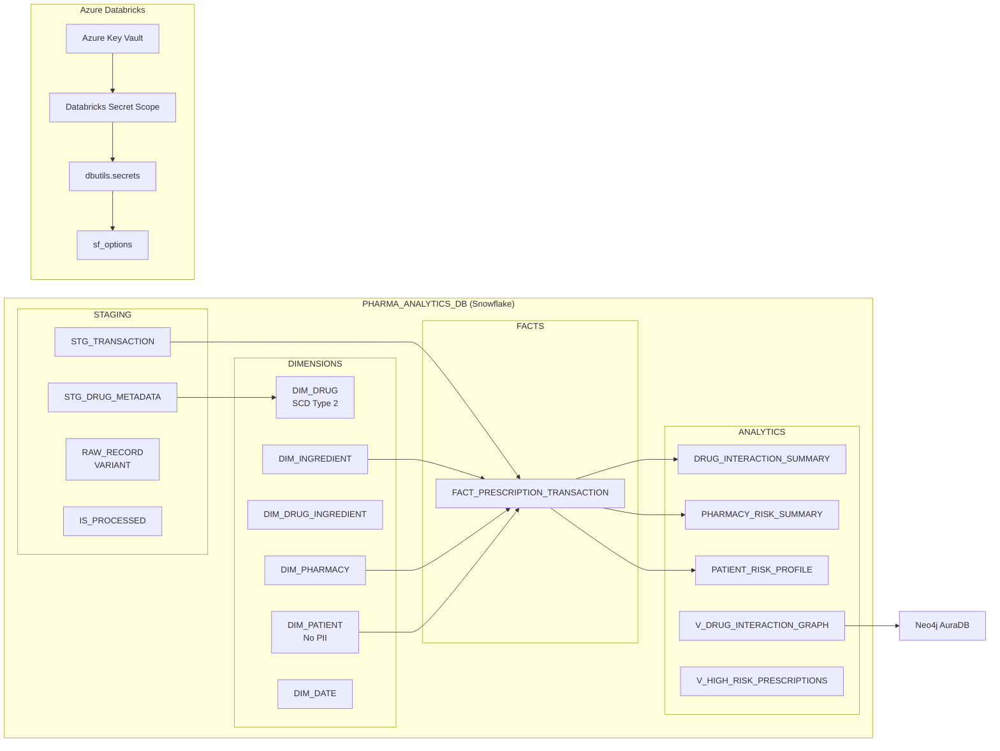

```
███████╗███╗   ██╗ ██████╗ ██╗    ██╗███████╗██╗      █████╗ ██╗  ██╗███████╗
██╔════╝████╗  ██║██╔═══██╗██║    ██║██╔════╝██║     ██╔══██╗██║ ██╔╝██╔════╝
███████╗██╔██╗ ██║██║   ██║██║ █╗ ██║█████╗  ██║     ███████║█████╔╝ █████╗
╚════██║██║╚██╗██║██║   ██║██║███╗██║██╔══╝  ██║     ██╔══██║██╔═██╗ ██╔══╝
███████║██║ ╚████║╚██████╔╝╚███╔███╔╝██║     ███████╗██║  ██║██║  ██╗███████╗
╚══════╝╚═╝  ╚═══╝ ╚═════╝  ╚══╝╚══╝ ╚═╝     ╚══════╝╚═╝  ╚═╝╚═╝  ╚═╝╚══════╝
              Snowflake Schema & Databricks Integration
```


> Enterprise-grade Snowflake schema and secure Databricks connector for the DataDose Pharmaceutical Drug Interaction Analytics Platform — covering 4-layer data warehouse design, SCD Type 2 drug dimensions, prescription fact tables, Neo4j export views, and a 7-step Azure Key Vault-backed connection setup.

---

## 📋 Table of Contents

- [✨ Features](#-features)
- [🛠 Tech Stack](#-tech-stack)
- [🏗 Architecture](#-architecture)
- [📁 Folder Structure](#-folder-structure)
- [⚠ Prerequisites](#-prerequisites)
- [🚀 Installation](#-installation)
- [📖 Usage](#-usage)
- [⚙ Configuration](#-configuration)
- [📦 Module Details](#-module-details)
- [🤝 Contributing](#-contributing)
- [📄 License](#-license)
- [🙏 Acknowledgments](#-acknowledgments)
- [📬 Contact](#-contact)

---

## ✨ Features

### 🗄 Schema Design
- **4-layer warehouse architecture** — Staging, Dimensions, Facts, and Analytics schemas in a single `PHARMA_ANALYTICS_DB` database
- **SCD Type 2 support** on `DIM_DRUG` via `EFFECTIVE_DATE`, `EXPIRY_DATE`, `IS_CURRENT`, and `RECORD_VERSION` columns for full historical drug record tracking
- **HIPAA-compliant patient dimension** — `DIM_PATIENT` stores only a hashed `PATIENT_TOKEN`; no PII persisted in Snowflake
- **VARIANT staging columns** — every staging table holds the full raw JSON payload in a `RAW_RECORD VARIANT` column for complete data lineage
- **Pre-built date dimension** — `DIM_DATE` populated for 2020–2030 with fiscal calendar, ISO week, holiday flags, and YYYYMMDD integer surrogate key

### 🔗 Neo4j Integration
- `DIM_INGREDIENT` carries `NEO4J_NODE_ID` and `NEO4J_LABELS` for direct graph node identity
- `DRUG_INTERACTION_SUMMARY` tracks `NEO4J_REL_TYPE` and `NEO4J_EXPORTED_AT` for idempotent relationship exports
- `V_DRUG_INTERACTION_GRAPH` view exposes a flat export surface ready for APOC import or `neo4j-admin` CSV bulk load

### ⚡ Performance & Clustering
- **Micro-partition clustering** on all major tables tuned to dominant query predicates (date, pharmacy, severity, source system)
- **Automatic Clustering** recommended on `FACT_PRESCRIPTION_TRANSACTION` for continuous maintenance at scale
- **Search Optimization** applied to equality-filter dimension lookups
- Result cache-friendly analytics layer with precomputed `DRUG_INTERACTION_SUMMARY`, `PHARMACY_RISK_SUMMARY`, and `PATIENT_RISK_PROFILE` tables

### 🔐 Security
- Dedicated `PYSPARK_ROLE` with per-schema `SELECT / INSERT / UPDATE / DELETE` grants and `FUTURE` table coverage
- Service user `PYSPARK_SVC` isolated from personal admin credentials
- Credentials stored in **Azure Key Vault** and surfaced to Databricks via a linked secret scope — never hard-coded in notebooks
- Dynamic Data Masking on `FIRST_WARNING`, `FIRST_ADVERSE_REACTION`, and `FIRST_DRUG_INTERACTION` for non-clinical roles
- Snowflake Time Travel (90 days) and Fail-safe (7 days) on Fact and Dimension tables for HIPAA audit trail

### 🔌 Databricks Connector
- Full PySpark `sf_options` setup using `dbutils.secrets` for zero-credential-in-code reads
- `safe_snowflake_read()` helper with targeted error handling for credential, network, JAR, and privilege failures
- Cross-schema write pattern by overriding `sfSchema` in a derived options dict (no hardcoded repeated config)
- Direct Snowflake SQL via `snowflake.connector` JDBC for DDL and UPDATE operations from notebook cells

---

## 🛠 Tech Stack

| Category | Technology | Version | Purpose |
|---|---|---|---|
| **Data Warehouse** | Snowflake (Standard Edition) | Cloud | Multi-schema analytical database |
| **Warehouse Compute** | Snowflake PHARMA_WH | X-SMALL → LARGE | Query execution & PySpark writes |
| **ETL Runtime** | Azure Databricks / PySpark | Spark 3.4 | Notebook-based read/write connector |
| **Spark Connector** | net.snowflake:spark-snowflake | 2.15.0-spark_3.4 | Spark ↔ Snowflake data transfer |
| **JDBC Driver** | net.snowflake:snowflake-jdbc | 3.14.4 | Underlying JDBC transport for connector |
| **Python Connector** | snowflake-connector-python | Latest | Direct SQL execution from notebook |
| **Secrets Manager** | Azure Key Vault | Cloud | Secure credential storage |
| **Secret Bridge** | Databricks Secret Scope | Managed | Key Vault ↔ `dbutils.secrets` link |
| **Graph Database** | Neo4j AuraDB | Cloud | Downstream drug interaction graph |
| **Schema Language** | Snowflake SQL / DDL | Standard | Table, view, warehouse, and role definitions |

---

## 🏗 Architecture




**Data flow:** PySpark ETL jobs write raw JSON events to Staging tables → a Snowflake Task or MERGE promotes records to Dimension and Fact tables (setting `IS_PROCESSED = TRUE`) → scheduled jobs compute Analytics aggregates → Neo4j bulk export runs from the `V_DRUG_INTERACTION_GRAPH` view.

---

## 📁 Folder Structure

```
SnowFlake/
├── DataDose-Schema.sql                          # Full DDL: warehouse, schemas, tables, views, DIM_DATE population
├── snowflake_databricks-setup.sql               # Role, user, and grant setup for PYSPARK_ROLE
├── databricks_snowflake_Connection-_notebook.py # PySpark notebook cells for Databricks connection
├── databricks_snowflake_connection-guide.docx   # 7-step human-readable connection guide (Azure Key Vault → Databricks)
├── pharma_snowflake-schema.docx                 # Full schema specification and data engineering doc (v2.0)
└── README.md                                    # This file
```

---

## ⚠ Prerequisites

1. **Snowflake account** with `ACCOUNTADMIN` or `SYSADMIN` access (required to create warehouse, database, and roles)
2. **Snowflake Edition** — Standard or higher (Enterprise features like Search Optimization and Row Access Policies require Enterprise; schema creation works on Standard)
3. **Azure subscription** with permission to create an Azure Key Vault and manage secrets
4. **Azure Databricks workspace** with an active cluster running **Databricks Runtime 13.3 LTS (Spark 3.4)** or compatible
5. **Cluster library install rights** — ability to add Maven libraries and restart the cluster
6. **Python package** — `snowflake-connector-python` installable via PyPI on the Databricks cluster (required only for Cell 9 direct JDBC operations)
7. **Network connectivity** — Databricks cluster must be able to reach `YTRRMJE-ZZ81345.snowflakecomputing.com` on HTTPS port 443. Use Snowflake Private Link or VPC peering for production environments.
8. **Neo4j AuraDB instance** (optional) — required only if using the graph export views in the Analytics schema

---

## 🚀 Installation

### Step 1 — Run the Snowflake DDL

Open **Snowsight → New Worksheet**, paste `DataDose-Schema.sql`, and run the blocks in order:

```sql
-- Block 0: Create warehouse (run FIRST)
CREATE WAREHOUSE IF NOT EXISTS PHARMA_WH
    WAREHOUSE_SIZE      = 'X-SMALL'
    AUTO_SUSPEND        = 60
    AUTO_RESUME         = TRUE
    INITIALLY_SUSPENDED = FALSE;

USE WAREHOUSE PHARMA_WH;

-- Block 1: Database and schemas
CREATE DATABASE IF NOT EXISTS PHARMA_ANALYTICS_DB;
CREATE SCHEMA IF NOT EXISTS PHARMA_ANALYTICS_DB.STAGING;
CREATE SCHEMA IF NOT EXISTS PHARMA_ANALYTICS_DB.DIMENSIONS;
CREATE SCHEMA IF NOT EXISTS PHARMA_ANALYTICS_DB.FACTS;
CREATE SCHEMA IF NOT EXISTS PHARMA_ANALYTICS_DB.ANALYTICS;
```

> **Run blocks in order:** Staging → Dimensions (including DIM_DATE population immediately after table creation) → Facts → Analytics. The fact table references dimension surrogate keys; running out of order causes FK errors.

### Step 2 — Set Up Roles and the PySpark Service User

Run `snowflake_databricks-setup.sql` in a Snowsight worksheet as `ACCOUNTADMIN`:

```sql
USE ROLE ACCOUNTADMIN;

CREATE ROLE IF NOT EXISTS PYSPARK_ROLE;

GRANT USAGE ON DATABASE PHARMA_ANALYTICS_DB TO ROLE PYSPARK_ROLE;
GRANT USAGE ON ALL SCHEMAS IN DATABASE PHARMA_ANALYTICS_DB TO ROLE PYSPARK_ROLE;
GRANT USAGE ON FUTURE SCHEMAS IN DATABASE PHARMA_ANALYTICS_DB TO ROLE PYSPARK_ROLE;

GRANT SELECT, INSERT, UPDATE, DELETE
    ON ALL TABLES IN DATABASE PHARMA_ANALYTICS_DB TO ROLE PYSPARK_ROLE;
GRANT SELECT, INSERT, UPDATE, DELETE
    ON FUTURE TABLES IN DATABASE PHARMA_ANALYTICS_DB TO ROLE PYSPARK_ROLE;

GRANT USAGE ON WAREHOUSE PHARMA_WH TO ROLE PYSPARK_ROLE;

CREATE USER IF NOT EXISTS PYSPARK_SVC
    PASSWORD             = '<your-strong-password>'
    DEFAULT_ROLE         = PYSPARK_ROLE
    DEFAULT_WAREHOUSE    = PHARMA_WH
    DEFAULT_NAMESPACE    = PHARMA_ANALYTICS_DB.STAGING
    MUST_CHANGE_PASSWORD = FALSE;

GRANT ROLE PYSPARK_ROLE TO USER PYSPARK_SVC;
GRANT ROLE PYSPARK_ROLE TO USER DATADOSE01;
```

> **Security:** Replace `<your-strong-password>` with a secure password before running. Store it immediately in Azure Key Vault (Step 3). Never commit this file to version control with a real password.

### Step 3 — Store Credentials in Azure Key Vault

Run these commands in **Azure Cloud Shell** (`portal.azure.com` → Cloud Shell icon):

```bash
# Create Key Vault (skip if one already exists)
az keyvault create \
  --name pharma-kv \
  --resource-group YOUR-RESOURCE-GROUP \
  --location eastus

# Store Snowflake secrets
az keyvault secret set --vault-name pharma-kv --name snowflake-account  --value "YTRRMJE-ZZ81345"
az keyvault secret set --vault-name pharma-kv --name snowflake-user     --value "PYSPARK_SVC"
az keyvault secret set --vault-name pharma-kv --name snowflake-password --value "<your-strong-password>"
```

### Step 4 — Link Key Vault to Databricks Secret Scope

Navigate to this URL in your browser (replace with your actual workspace URL):

```
https://<your-databricks-workspace>.azuredatabricks.net/#secrets/createScope
```

Fill in the form:
- **Scope name:** `pharma-snowflake`
- **DNS name:** `https://pharma-kv.vault.azure.net/`
- **Resource ID:** `/subscriptions/<sub-id>/resourceGroups/<rg>/providers/Microsoft.KeyVault/vaults/pharma-kv`

Verify the scope was created in a notebook cell:

```python
dbutils.secrets.listScopes()
# Expected: [SecretScope(name='pharma-snowflake')]

dbutils.secrets.list("pharma-snowflake")
# Expected: snowflake-account, snowflake-password, snowflake-user
```

### Step 5 — Install Cluster Libraries

In Databricks go to **Compute → your cluster → Libraries → Install new** and add both Maven libraries:

```
Type: Maven
Coordinates: net.snowflake:spark-snowflake_2.12:2.15.0-spark_3.4

Type: Maven
Coordinates: net.snowflake:snowflake-jdbc:3.14.4
```

> After installing both libraries, **restart the cluster** before running any notebook cells. The JARs only load on cluster start.

### Step 6 — Verify Connection

Open a new notebook attached to the cluster and run the connection setup cell from `databricks_snowflake_Connection-_notebook.py`:

```python
SNOWFLAKE_SOURCE = "net.snowflake.spark.snowflake"

sf_options = {
    "sfURL"       : "YTRRMJE-ZZ81345.snowflakecomputing.com",
    "sfUser"      : dbutils.secrets.get(scope="pharma-snowflake", key="snowflake-user"),
    "sfPassword"  : dbutils.secrets.get(scope="pharma-snowflake", key="snowflake-password"),
    "sfDatabase"  : "PHARMA_ANALYTICS_DB",
    "sfSchema"    : "STAGING",
    "sfWarehouse" : "PHARMA_WH",
    "sfRole"      : "PYSPARK_ROLE",
}

# Connectivity test
connection_test_df = (
    spark.read
    .format(SNOWFLAKE_SOURCE)
    .options(**sf_options)
    .option("query", "SELECT CURRENT_USER() AS user, CURRENT_DATABASE() AS database, CURRENT_ROLE() AS role")
    .load()
)
connection_test_df.show()
```

Expected output:
```
+-------------+--------------------+-------------+
| user        | database           | role        |
+-------------+--------------------+-------------+
| PYSPARK_SVC | PHARMA_ANALYTICS_DB| PYSPARK_ROLE|
+-------------+--------------------+-------------+
```

---

## 📖 Usage

### Basic Usage — Read a Dimension Table

```python
# Read DIM_DRUG
drug_dimension_df = (
    spark.read
    .format(SNOWFLAKE_SOURCE)
    .options(**sf_options)
    .option("dbtable", "DIMENSIONS.DIM_DRUG")
    .load()
)

print(f"DIM_DRUG rows: {drug_dimension_df.count()}")
drug_dimension_df.show(5, truncate=40)
```

### Advanced Usage — Custom Query with Filters

```python
# Read high-risk prescriptions from FACTS
high_risk_df = (
    spark.read
    .format(SNOWFLAKE_SOURCE)
    .options(**sf_options)
    .option("query", """
        SELECT TX_ID, DRUG_NAME_AS_DISPENSED,
               INTERACTION_SEVERITY, PATIENT_RISK_SCORE,
               DRUG_RISK_SCORE, POLYPHARMACY_FLAG
        FROM   FACTS.FACT_PRESCRIPTION_TRANSACTION
        WHERE  INTERACTION_FOUND = TRUE
          AND  INTERACTION_SEVERITY IN ('Major', 'Moderate')
        ORDER  BY PATIENT_RISK_SCORE DESC
        LIMIT  1000
    """)
    .load()
)
high_risk_df.show(10, truncate=50)
```

### Write to Staging Table

```python
# Append enriched PySpark DataFrame to staging
df_raw.write \
    .format(SNOWFLAKE_SOURCE) \
    .options(**sf_options) \
    .option("dbtable", "STAGING.STG_DRUG_METADATA") \
    .mode("append") \
    .save()
```

### Write to a Different Schema

Override `sfSchema` in a derived options dict — no need to rebuild the full config:

```python
# Write to FACTS schema
sf_facts_options = {**sf_options, "sfSchema": "FACTS"}
df_processed.write \
    .format(SNOWFLAKE_SOURCE) \
    .options(**sf_facts_options) \
    .option("dbtable", "FACT_PRESCRIPTION_TRANSACTION") \
    .mode("append") \
    .save()

# Write to ANALYTICS schema
sf_analytics_options = {**sf_options, "sfSchema": "ANALYTICS"}
df_summary.write \
    .format(SNOWFLAKE_SOURCE) \
    .options(**sf_analytics_options) \
    .option("dbtable", "PHARMACY_RISK_SUMMARY") \
    .mode("append") \
    .save()
```

### Direct SQL via JDBC Connector

```python
import snowflake.connector

conn = snowflake.connector.connect(
    user      = dbutils.secrets.get(scope="pharma-snowflake", key="snowflake-user"),
    password  = dbutils.secrets.get(scope="pharma-snowflake", key="snowflake-password"),
    account   = "YTRRMJE-ZZ81345",
    warehouse = "PHARMA_WH",
    database  = "PHARMA_ANALYTICS_DB",
    schema    = "STAGING",
    role      = "PYSPARK_ROLE",
)

cursor = conn.cursor()
cursor.execute("""
    UPDATE STAGING.STG_DRUG_METADATA
    SET IS_PROCESSED = TRUE
    WHERE BATCH_ID = 'KAFKA-001-A1B2C3D4'
""")
print(f"Rows updated: {cursor.rowcount}")
cursor.close()
conn.close()
```

### Safe Read with Error Handling

```python
def safe_snowflake_read(query, schema="STAGING"):
    """Read from Snowflake with targeted error diagnostics."""
    try:
        options = {**sf_options, "sfSchema": schema}
        result_df = (
            spark.read
            .format(SNOWFLAKE_SOURCE)
            .options(**options)
            .option("query", query)
            .load()
        )
        print(f"Read successful: {result_df.count()} rows")
        return result_df
    except Exception as e:
        error_msg = str(e)
        if "Net connect timed out" in error_msg:
            print(f"ERROR: Cannot reach Snowflake. Check sfURL: {sf_options['sfURL']}")
        elif "Incorrect username or password" in error_msg:
            print("ERROR: Wrong credentials. Check Key Vault secrets.")
        elif "Insufficient privileges" in error_msg:
            print("ERROR: PYSPARK_ROLE missing a grant. Re-run snowflake_databricks-setup.sql.")
        elif "ClassNotFoundException" in error_msg:
            print("ERROR: Snowflake JAR not loaded. Restart cluster after installing Maven library.")
        else:
            print(f"ERROR: {error_msg}")
        return None

# Usage
result_df = safe_snowflake_read(
    "SELECT COUNT(*) AS cnt FROM DIMENSIONS.DIM_DATE",
    schema="DIMENSIONS"
)
```

---

## ⚙ Configuration

### Snowflake Connection Options (`sf_options`)

| Option | Type | Value | Description |
|---|---|---|---|
| `sfURL` | string | `YTRRMJE-ZZ81345.snowflakecomputing.com` | Snowflake account URL |
| `sfUser` | string | From Key Vault (`snowflake-user`) | Snowflake login username |
| `sfPassword` | string | From Key Vault (`snowflake-password`) | Snowflake login password |
| `sfDatabase` | string | `PHARMA_ANALYTICS_DB` | Target database |
| `sfSchema` | string | `STAGING` (default) | Target schema; override per write |
| `sfWarehouse` | string | `PHARMA_WH` | Virtual warehouse for compute |
| `sfRole` | string | `PYSPARK_ROLE` | Execution role |

### Azure Key Vault Secrets (`pharma-kv`)

| Secret Name | Value Stored | Used By |
|---|---|---|
| `snowflake-account` | `YTRRMJE-ZZ81345` | Connection reference |
| `snowflake-user` | `PYSPARK_SVC` | `sf_options['sfUser']` |
| `snowflake-password` | Service user password | `sf_options['sfPassword']` |

### Databricks Secret Scope

| Scope | Key | Maps To |
|---|---|---|
| `pharma-snowflake` | `snowflake-user` | `PYSPARK_SVC` |
| `pharma-snowflake` | `snowflake-password` | PYSPARK_SVC password |

### Warehouse Sizing Guide

| Workload | Recommended Size | Notes |
|---|---|---|
| Interactive BI queries | `X-SMALL` or `SMALL` | Default; auto-suspends after 60s |
| PySpark bulk loads (initial) | `LARGE` or `X-LARGE` | Scale up for initial ingestion runs |
| Scheduled analytics refresh | `SMALL` | Sufficient for incremental aggregation jobs |

### Schema Run Order (DDL)

| Block | File | Description | Dependency |
|---|---|---|---|
| 0 | `DataDose-Schema.sql` | Create `PHARMA_WH` warehouse | None — run first |
| 1 | `DataDose-Schema.sql` | Database + 4 schemas | Block 0 |
| 2 | `DataDose-Schema.sql` | Staging tables | Block 1 |
| 3 | `DataDose-Schema.sql` | Dimension tables + `DIM_DATE` population | Block 1 |
| 4 | `DataDose-Schema.sql` | Fact table | Block 3 |
| 5 | `DataDose-Schema.sql` | Analytics tables + views | Block 4 |
| — | `snowflake_databricks-setup.sql` | Role, service user, grants | Block 1 |

---

## 📦 Module Details

### `DataDose-Schema.sql`

> Complete Snowflake DDL that creates the entire `PHARMA_ANALYTICS_DB` database — warehouse, 4 schemas, 10 tables, `DIM_DATE` population (2020–2030), analytics views, and verification queries.

**Key Components:**

| Object | Type | Schema | Description |
|---|---|---|---|
| `PHARMA_WH` | Warehouse | — | X-SMALL, auto-suspend 60s, auto-resume |
| `PHARMA_ANALYTICS_DB` | Database | — | Top-level database for the platform |
| `STG_DRUG_METADATA` | Table | STAGING | Raw drug metadata; all VARCHAR + VARIANT `RAW_RECORD`; clustered on `(LOAD_TIMESTAMP, SOURCE_SYSTEM)` |
| `STG_TRANSACTION` | Table | STAGING | Raw prescription events; clustered on `(LOAD_TIMESTAMP, PHARMACY, CITY)` |
| `DIM_DRUG` | Table | DIMENSIONS | SCD Type 2 drug master; 27 columns including `EFFECTIVE_DATE`, `EXPIRY_DATE`, `IS_CURRENT`, `RECORD_VERSION` |
| `DIM_INGREDIENT` | Table | DIMENSIONS | Active pharmaceutical ingredients with `NEO4J_NODE_ID` and `NEO4J_LABELS` |
| `DIM_DRUG_INGREDIENT` | Table | DIMENSIONS | Many-to-many bridge between drugs and ingredients |
| `DIM_PHARMACY` | Table | DIMENSIONS | Pharmacy master with NPI, NCPDP, city, state |
| `DIM_PATIENT` | Table | DIMENSIONS | De-identified patient dimension (token only, no PII) |
| `DIM_DATE` | Table | DIMENSIONS | Date spine with ISO week, fiscal calendar, holiday flag; populated 2020–2030 |
| `FACT_PRESCRIPTION_TRANSACTION` | Table | FACTS | Central fact; clustered on `(TX_DATE_SK, PHARMACY_SK, INTERACTION_SEVERITY)`; 26 columns |
| `DRUG_INTERACTION_SUMMARY` | Table | ANALYTICS | Interaction pair aggregation with `NEO4J_REL_TYPE` and `NEO4J_EXPORTED_AT` |
| `PHARMACY_RISK_SUMMARY` | Table | ANALYTICS | Daily pharmacy-level risk rollup |
| `PATIENT_RISK_PROFILE` | Table | ANALYTICS | Longitudinal patient risk snapshot |
| `V_DRUG_INTERACTION_GRAPH` | View | ANALYTICS | Flat Neo4j bulk export surface |
| `V_HIGH_RISK_PRESCRIPTIONS` | View | ANALYTICS | Real-time clinical monitoring view |

**Dependencies:** None — standalone DDL file. Run before `databricks_snowflake_Connection-_notebook.py`.

---

### `snowflake_databricks-setup.sql`

> Snowflake SQL that provisions the `PYSPARK_ROLE`, service user `PYSPARK_SVC`, and all required grants for Databricks to read and write `PHARMA_ANALYTICS_DB`.

**Key Components:**

| Statement | Description |
|---|---|
| `CREATE ROLE PYSPARK_ROLE` | Dedicated role for all PySpark operations |
| `GRANT USAGE ON DATABASE` | Top-level database access |
| `GRANT USAGE ON ALL/FUTURE SCHEMAS` | Current and future schema access |
| `GRANT SELECT/INSERT/UPDATE/DELETE ON ALL/FUTURE TABLES` | Full DML on all current and future tables |
| Per-schema grants (STAGING, DIMENSIONS, FACTS, ANALYTICS) | Explicit schema-level grants for defense-in-depth |
| `GRANT SELECT ON ALL/FUTURE VIEWS (ANALYTICS)` | Read access on analytics views |
| `GRANT USAGE ON WAREHOUSE PHARMA_WH` | Compute access |
| `CREATE USER PYSPARK_SVC` | Service user with `PYSPARK_ROLE` as default |
| `GRANT ROLE PYSPARK_ROLE TO USER DATADOSE01` | Allows admin to `USE ROLE PYSPARK_ROLE` for testing |
| Verification (`SHOW GRANTS`) | Confirms all grants applied correctly |

**Dependencies:** `DataDose-Schema.sql` Block 0–1 must be run first (database must exist).

---

### `databricks_snowflake_Connection-_notebook.py`

> Python notebook cells for Azure Databricks that configure the Snowflake Spark connector using `dbutils.secrets`, test connectivity, read dimension and fact data, write staging rows, and run direct JDBC updates.

**Key Components:**

| Cell | Function / Code | Description |
|---|---|---|
| Cell 1 | JAR install instructions | Maven coordinates for Spark connector and JDBC driver |
| Cell 2 | `sf_options` dict | Connection options built from `dbutils.secrets` |
| Cell 3 | Connectivity test | `SELECT CURRENT_USER()` query to verify identity |
| Cell 4 | `drug_dimension_df` | Full table read of `DIMENSIONS.DIM_DRUG` |
| Cell 5 | `high_risk_interactions_df` | Filtered query from `FACTS.FACT_PRESCRIPTION_TRANSACTION` |
| Cell 6 | Staging write | Creates test `Row`, writes to `STAGING.STG_DRUG_METADATA` via `mode("append")` |
| Cell 7 | Cross-schema write pattern | `sf_facts_options` and `sf_analytics_options` derived from base `sf_options` |
| Cell 8 | `high_risk_prescriptions_df` | Reads `V_HIGH_RISK_PRESCRIPTIONS` analytics view |
| Cell 9 | `snowflake.connector` JDBC | Direct SQL: `UPDATE STG_DRUG_METADATA SET IS_PROCESSED = TRUE` |
| Cell 10 | `safe_snowflake_read()` | Error-handling wrapper with 4 targeted diagnostic messages |

**Dependencies:** `dbutils` (Databricks global), `spark` session, Snowflake JARs on cluster, `pharma-snowflake` secret scope, `snowflake-connector-python` PyPI package (Cell 9 only).

---

### `databricks_snowflake_connection-guide.docx`

> 7-step human-readable connection guide covering the full Azure Key Vault → Databricks Secret Scope → PySpark connection setup with a troubleshooting reference table and account quick reference.

**Key Sections:**

| Step | Description |
|---|---|
| Step 1 — Snowflake Setup | Create `PYSPARK_ROLE` and `PYSPARK_SVC` service user via Snowsight |
| Step 2 — Azure Key Vault | `az keyvault create` and `az keyvault secret set` commands for 3 secrets |
| Step 3 — Databricks Secret Scope | Browser-based scope creation linking Key Vault; `dbutils.secrets` verification |
| Step 4 — Install JAR | Maven coordinates and cluster restart instruction |
| Step 5 — Notebook Code | `sf_options` dict template |
| Step 6 — Test Connection | `SELECT CURRENT_USER()` with expected output |
| Step 7 — Read and Write Data | 4 code examples: read table, read query, write staging, write to different schema |
| Troubleshooting Reference | 6-row table mapping error messages to causes and fixes |
| Quick Reference | Account, URL, users, warehouse, Key Vault, and secret scope values |

---

### `pharma_snowflake-schema.docx`

> Enterprise schema design specification (v2.0) covering all 4 layers, every table's column definitions with data types and constraints, SCD Type 2 design notes, clustering rationale, Neo4j export mapping, PySpark pipeline integration conventions, and security/compliance design.

**Key Sections:**

| Section | Content |
|---|---|
| Section 3 — Staging Tables | Full column specs for `STG_DRUG_METADATA` (24 cols) and `STG_TRANSACTION` (26 cols) |
| Section 4 — Dimension Tables | Column specs for all 6 dimension tables including SCD2 fields on `DIM_DRUG` and HIPAA note on `DIM_PATIENT` |
| Section 5 — Fact Table | `FACT_PRESCRIPTION_TRANSACTION` grain, clustering keys, 26-column spec |
| Section 6 — Analytics Layer | `DRUG_INTERACTION_SUMMARY`, `PHARMACY_RISK_SUMMARY`, `PATIENT_RISK_PROFILE`, and view descriptions |
| Section 7 — Clustering | Cluster key rationale for every table; Automatic Clustering and Search Optimization recommendations |
| Section 8 — Neo4j Integration | Node/relationship mapping table; `NEO4J_EXPORTED_AT` idempotency pattern; recommended export order |
| Section 9 — PySpark Integration | `mode("append")`, `IS_PROCESSED` flag pattern, `RAW_RECORD VARIANT` lineage convention |
| Section 10 — Security | `PATIENT_TOKEN` only, Row Access Policy, Dynamic Data Masking, Time Travel (90 days), Fail-safe (7 days), Private Link recommendation |

---

## 🤝 Contributing

Contributions are welcome. Please follow these steps:

1. Fork the repository
2. Create a feature branch: `git checkout -b feature/your-feature-name`
3. Commit your changes: `git commit -m "feat: describe your change"`
4. Push the branch: `git push origin feature/your-feature-name`
5. Open a Pull Request with a description of what changed and any testing performed against Snowflake

> Before submitting DDL changes, test them block by block in Snowsight against a sandbox account. Ensure `GRANT` statements are included for any new tables or schemas so `PYSPARK_ROLE` access is not broken.

---

## 📄 License

See [LICENSE](LICENSE) file for details.

---

## 🙏 Acknowledgments

- [Snowflake Documentation](https://docs.snowflake.com/) — Data Warehouse DDL, clustering, SCD design patterns
- [Snowflake Connector for Spark](https://docs.snowflake.com/en/user-guide/spark-connector) — `net.snowflake:spark-snowflake_2.12` connector
- [Snowflake JDBC Driver](https://docs.snowflake.com/en/developer-guide/jdbc/jdbc) — `net.snowflake:snowflake-jdbc`
- [snowflake-connector-python](https://docs.snowflake.com/en/developer-guide/python-connector/python-connector) — Direct SQL execution from Python
- [Azure Key Vault](https://learn.microsoft.com/en-us/azure/key-vault/) — Managed secret storage
- [Databricks Secret Scopes](https://docs.databricks.com/en/security/secrets/secret-scopes.html) — Key Vault ↔ `dbutils.secrets` bridge
- [Neo4j APOC](https://neo4j.com/labs/apoc/) — Graph bulk import from Snowflake CSV exports

---

## 📬 Contact

For schema design questions, role/grant issues, or Databricks connectivity problems, open an issue in the repository or contact the Data Architecture team through your organization's internal channels.

---

*Part of the DataDose Pharmaceutical Drug Interaction Analytics Platform — Snowflake Schema v2.0 | Azure Databricks Integration v3.0*
