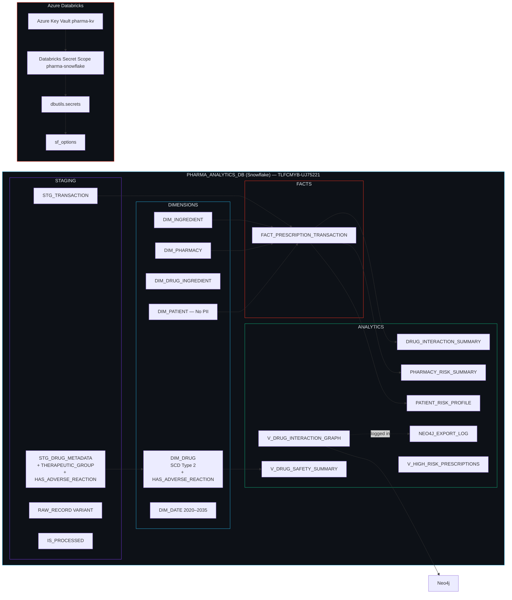

<p align="center">
  
</p>

<div align="center">

<br/>

<p align="center">
  <strong>Enterprise-grade Snowflake schema &amp; secure Databricks connector</strong><br/>
  4-layer data warehouse · SCD Type 2 · Neo4j export · Azure Key Vault — <strong>v3.0</strong>
</p>

<br/>

<p align="center">
  
  
  
  
  
  
  
</p>

<br/>

<table>
<tr>
  <td align="center"><br/><sub><b>Staging → Dim → Fact → Analytics</b></sub></td>
  <td align="center"><br/><sub><b>2020–2035</b></sub></td>
  <td align="center"><br/><sub><b>Full History</b></sub></td>
  <td align="center"><br/><sub><b>TLFCMYB-UJ75221</b></sub></td>
</tr>
</table>

</div>


<a id="toc"></a>
<p align="center"></p>

<table><tr><td>

| Section | Section |
|---|---|
| 🆕 [What's New in v3.0](#whats-new-in-v30) | 📖 [Usage](#usage) |
| ✨ [Features](#features) | ⚙️ [Configuration](#configuration) |
| 🛠️ [Tech Stack](#tech-stack) | 📦 [Module Details](#module-details) |
| 🏗️ [Architecture](#architecture) | 🤝 [Contributing](#contributing) |
| 📁 [Folder Structure](#folder-structure) | 📄 [License](#license) |
| ⚠️ [Prerequisites](#prerequisites) | 🙏 [Acknowledgments](#acknowledgments) |
| 🚀 [Installation](#installation) | 📬 [Contact](#contact) |

</td></tr></table>


<a id="whats-new-in-v30"></a>
<p align="center"></p>

> ⚠️ **Migration note:** The previous trial account (`YTRRMJE-ZZ81345`) has expired. You must use the new account (`TLFCMYB-UJ75221`) and re-run the full DDL from scratch — there is no in-place upgrade path between accounts.

| Area | v2.0 | v3.0 |
|---|---|---|
| **Snowflake Account** | `YTRRMJE-ZZ81345` (expired) | `TLFCMYB-UJ75221` |
| **Admin User** | `DATADOSE01` | `DataDose` |
| **Service Password** | *(unspecified)* | `DataDoseAzure2025!` *(rotate before production use)* |
| **`STG_DRUG_METADATA`** | Missing `THERAPEUTIC_GROUP` | ✅ Added `THERAPEUTIC_GROUP VARCHAR(300)` |
| **`STG_DRUG_METADATA` / `DIM_DRUG`** | No adverse-reaction flag | ✅ Added `HAS_ADVERSE_REACTION` |
| **`DIM_DRUG.EXPIRY_DATE` default** | String literal — silently failed under some locales | ✅ Fixed: `DEFAULT TO_DATE('9999-12-31','YYYY-MM-DD')` |
| **`DIM_DATE` population** | Missing INSERT block | ✅ Full `GENERATOR`-based INSERT — **5,844 rows** (2020–2035) |
| **`DIM_DRUG` cluster key** | `(TRADE_NAME)` | ✅ `(IS_CURRENT, THERAPEUTIC_GROUP, DOSAGE_FORM)` |
| **`ANALYTICS.NEO4J_EXPORT_LOG`** | Did not exist | ✅ New audit table for every Snowflake → Neo4j export run |
| **`ANALYTICS.V_DRUG_SAFETY_SUMMARY`** | Did not exist | ✅ New view — pre-aggregated per-drug safety KPIs |
| **Per-schema FUTURE GRANTS** | Database-level only | ✅ Explicit per-schema `FUTURE` grants for all 4 schemas |
| **`DIM_DATE` row count** | 4,018 rows (2020–2030) | **5,844 rows** (2020–2035) |

<p align="right"><sub><a href="#toc">↑ back to top</a></sub></p>


<a id="features"></a>
<p align="center"></p>

<table>
<tr>
<td width="50%" valign="top">

#### 🗄 Schema Design
- **4-layer warehouse architecture** — Staging, Dimensions, Facts, and Analytics in a single `PHARMA_ANALYTICS_DB` database
- **SCD Type 2** on `DIM_DRUG` via `EFFECTIVE_DATE`, `EXPIRY_DATE`, `IS_CURRENT`, `RECORD_VERSION`
- **HIPAA-compliant patient dimension** — `DIM_PATIENT` stores only a hashed `PATIENT_TOKEN`; no PII in Snowflake
- **VARIANT staging columns** — every staging table holds the full raw JSON payload in `RAW_RECORD VARIANT` for data lineage
- **Extended date dimension** — `DIM_DATE` populated 2020–2035 (5,844 rows) with fiscal calendar, ISO week, and holiday flags
- **Therapeutic classification** — `THERAPEUTIC_GROUP` flows from staging through to `DIM_DRUG` for drug-class rollups
- **Adverse-reaction flag** — `HAS_ADVERSE_REACTION BOOLEAN` on `DIM_DRUG` for fast filtering

</td>
<td width="50%" valign="top">

#### 🔗 Neo4j Integration
- `DIM_INGREDIENT` carries `NEO4J_NODE_ID` and `NEO4J_LABELS` for direct graph node identity
- `DRUG_INTERACTION_SUMMARY` tracks `NEO4J_REL_TYPE` and `NEO4J_EXPORTED_AT` for idempotent exports
- `V_DRUG_INTERACTION_GRAPH` — flat export surface ready for APOC import or `neo4j-admin` CSV bulk load
- **`NEO4J_EXPORT_LOG`** *(new in v3.0)* — audits every export run with record counts, status, and error detail

#### ⚡ Performance & Clustering
- Micro-partition clustering on all major tables tuned to dominant query predicates
- `DIM_DRUG` re-clustered in v3.0 on `(IS_CURRENT, THERAPEUTIC_GROUP, DOSAGE_FORM)`
- Automatic Clustering recommended on `FACT_PRESCRIPTION_TRANSACTION`
- `V_DRUG_SAFETY_SUMMARY` *(new in v3.0)* feeds Power BI directly without live aggregation

#### 🔐 Security
- Dedicated `PYSPARK_ROLE` with per-schema `SELECT / INSERT / UPDATE / DELETE` + `FUTURE` grants for all 4 schemas
- Credentials stored in **Azure Key Vault** (`pharma-kv`) surfaced via the `pharma-snowflake` Databricks secret scope

</td>
</tr>
</table>

<p align="right"><sub><a href="#toc">↑ back to top</a></sub></p>


<a id="tech-stack"></a>
<p align="center"></p>

| Category | Technology | Version | Purpose |
|---|---|---|---|
| **Data Warehouse** | Snowflake (Standard Edition) | Cloud | Multi-schema analytical database |
| **Warehouse Compute** | `PHARMA_WH` | X-SMALL, auto-suspend 60s | Query execution & PySpark writes |
| **ETL Runtime** | Azure Databricks / PySpark | Spark 3.4 | Notebook-based read/write connector |
| **Spark Connector** | `net.snowflake:spark-snowflake_2.12` | `2.15.0-spark_3.4` | Spark ↔ Snowflake data transfer |
| **JDBC Driver** | `net.snowflake:snowflake-jdbc` | `3.14.4` | Underlying JDBC transport |
| **Python Connector** | `snowflake-connector-python` | Latest | Direct SQL execution from notebook |
| **Secrets Manager** | Azure Key Vault (`pharma-kv`) | Cloud | Secure credential storage |
| **Secret Bridge** | Databricks Secret Scope (`pharma-snowflake`) | Managed | Key Vault ↔ `dbutils.secrets` link |
| **Graph Database** | Neo4j (AuraDB or self-hosted) | Cloud | Downstream drug interaction graph |
| **Cloud Platform** | Microsoft Azure | — | Hosts Databricks, Key Vault, and Neo4j |
| **Schema Language** | Snowflake SQL / DDL | Standard | Table, view, warehouse, and role definitions |

<p align="right"><sub><a href="#toc">↑ back to top</a></sub></p>


<a id="architecture"></a>
<p align="center"></p>

<div align="center"><sub><b>PHARMA_ANALYTICS_DB — TLFCMYB-UJ75221</b></sub></div>
<br/>



**Data flow:** PySpark ETL jobs write raw JSON events to Staging → MERGE promotes records to Dimensions and Facts (`IS_PROCESSED = TRUE`) → scheduled jobs compute Analytics aggregates → Neo4j bulk export runs from `V_DRUG_INTERACTION_GRAPH`, logged to `NEO4J_EXPORT_LOG` → `V_DRUG_SAFETY_SUMMARY` feeds Power BI cards directly.

<p align="right"><sub><a href="#toc">↑ back to top</a></sub></p>


<a id="folder-structure"></a>
<p align="center"></p>

```
SnowFlake/
├── Warehouse___Database_Setup.sql        # Block 0–1: warehouse, database, 4 schemas
├── Service_Role_and_User.sql             # Block 2: PYSPARK_ROLE, PYSPARK_SVC, all grants
├── STAGING_TABLES.sql                    # Block 3: STG_DRUG_METADATA, STG_TRANSACTION
├── DIMENSION_TABLES.sql                  # Block 4: DIM_DATE (+ population), DIM_DRUG,
│                                         #          DIM_INGREDIENT, DIM_PHARMACY,
│                                         #          DIM_PATIENT, DIM_DRUG_INGREDIENT
├── FACT_TABLE.sql                        # Block 5: FACT_PRESCRIPTION_TRANSACTION
├── ANALYTICS_TABLES.sql                  # Block 6: DRUG_INTERACTION_SUMMARY,
│                                         #          PHARMACY_RISK_SUMMARY,
│                                         #          PATIENT_RISK_PROFILE, NEO4J_EXPORT_LOG
├── VIEWS.sql                             # Block 9: V_DRUG_INTERACTION_GRAPH,
│                                         #          V_HIGH_RISK_PRESCRIPTIONS,
│                                         #          V_DRUG_SAFETY_SUMMARY
├── VERIFICATION_QUERIES.sql              # Block 10: post-deploy checks
├── DataDose_Setup_Guide.docx             # New Account Setup Guide — v3.0 walkthrough
├── DataDose_Dimensional_Model_Guide.docx # Star schema explainer, design decisions, example queries
└── README.md                             # This file
```

> Blocks 7 (Search Optimization) and 8 (Row Access Policy) are Enterprise-edition-only — intentionally omitted for this Standard-edition account.

<p align="right"><sub><a href="#toc">↑ back to top</a></sub></p>


<a id="prerequisites"></a>
<p align="center"></p>

1. **Snowflake account** with `ACCOUNTADMIN` access — required to create the warehouse, database, and `PYSPARK_ROLE`
2. **Snowflake Edition** — Standard or higher. Search Optimization and Row Access Policies require Enterprise; everything else in this schema runs on Standard
3. **Azure subscription** with permission to create an Azure Key Vault (`pharma-kv`) and manage secrets
4. **Azure Databricks workspace** with an active cluster on a Databricks Runtime compatible with **Spark 3.4**
5. **Cluster library install rights** — ability to add Maven libraries and restart the cluster
6. **Python package** — `snowflake-connector-python` installable via PyPI on the Databricks cluster (only needed for direct JDBC operations)
7. **Network connectivity** — the Databricks cluster must reach `TLFCMYB-UJ75221.snowflakecomputing.com` on HTTPS port 443
8. **Neo4j instance** *(optional)* — only required if using the graph export views and `NEO4J_EXPORT_LOG`

<p align="right"><sub><a href="#toc">↑ back to top</a></sub></p>


<a id="installation"></a>
<p align="center"></p>

#### Step 1 — Create the Warehouse, Database & Schemas

Open **Snowsight → New Worksheet**, paste `Warehouse___Database_Setup.sql`, and run it:

```sql
-- BLOCK 0: WAREHOUSE (run first)
CREATE WAREHOUSE IF NOT EXISTS PHARMA_WH
    WAREHOUSE_SIZE      = 'X-SMALL'
    AUTO_SUSPEND        = 60
    AUTO_RESUME         = TRUE
    INITIALLY_SUSPENDED = FALSE;

USE WAREHOUSE PHARMA_WH;

-- BLOCK 1: DATABASE + SCHEMAS
CREATE DATABASE IF NOT EXISTS PHARMA_ANALYTICS_DB;
CREATE SCHEMA IF NOT EXISTS PHARMA_ANALYTICS_DB.STAGING;
CREATE SCHEMA IF NOT EXISTS PHARMA_ANALYTICS_DB.DIMENSIONS;
CREATE SCHEMA IF NOT EXISTS PHARMA_ANALYTICS_DB.FACTS;
CREATE SCHEMA IF NOT EXISTS PHARMA_ANALYTICS_DB.ANALYTICS;
USE DATABASE PHARMA_ANALYTICS_DB;
```

#### Step 2 — Deploy the Schema in Order

Run the remaining `.sql` files **in this exact order**:

| Order | File | Creates | Depends On |
|---|---|---|---|
| 1 | `Service_Role_and_User.sql` | `PYSPARK_ROLE`, grants, `PYSPARK_SVC` | Step 1 |
| 2 | `STAGING_TABLES.sql` | `STG_DRUG_METADATA`, `STG_TRANSACTION` | Step 1 |
| 3 | `DIMENSION_TABLES.sql` | `DIM_DATE` (+ 5,844-row population) + all other dimensions | Step 1 |
| 4 | `FACT_TABLE.sql` | `FACT_PRESCRIPTION_TRANSACTION` | Step 3 (all dimensions) |
| 5 | `ANALYTICS_TABLES.sql` | Aggregation tables + `NEO4J_EXPORT_LOG` | Step 4 |
| 6 | `VIEWS.sql` | 3 analytics views | Step 5 |
| 7 | `VERIFICATION_QUERIES.sql` | Post-deploy checks | All prior steps |

```sql
USE ROLE ACCOUNTADMIN;
CREATE ROLE IF NOT EXISTS PYSPARK_ROLE;
GRANT USAGE ON DATABASE PHARMA_ANALYTICS_DB TO ROLE PYSPARK_ROLE;
GRANT USAGE ON ALL SCHEMAS IN DATABASE PHARMA_ANALYTICS_DB TO ROLE PYSPARK_ROLE;
GRANT USAGE ON FUTURE SCHEMAS IN DATABASE PHARMA_ANALYTICS_DB TO ROLE PYSPARK_ROLE;
GRANT SELECT, INSERT, UPDATE, DELETE
    ON ALL TABLES IN DATABASE PHARMA_ANALYTICS_DB TO ROLE PYSPARK_ROLE;
GRANT SELECT, INSERT, UPDATE, DELETE
    ON FUTURE TABLES IN DATABASE PHARMA_ANALYTICS_DB TO ROLE PYSPARK_ROLE;
GRANT USAGE ON WAREHOUSE PHARMA_WH TO ROLE PYSPARK_ROLE;
CREATE USER IF NOT EXISTS PYSPARK_SVC
    PASSWORD             = '<your-strong-password>'
    DEFAULT_ROLE         = PYSPARK_ROLE
    DEFAULT_WAREHOUSE    = PHARMA_WH
    DEFAULT_NAMESPACE    = PHARMA_ANALYTICS_DB.STAGING
    MUST_CHANGE_PASSWORD = FALSE;
GRANT ROLE PYSPARK_ROLE TO USER PYSPARK_SVC;
GRANT ROLE PYSPARK_ROLE TO USER DataDose;
```

> 🔐 Replace `<your-strong-password>` before running. Store the real value in Azure Key Vault (Step 3) immediately. Never commit real credentials to version control.

#### Step 3 — Store Credentials in Azure Key Vault

```bash
az keyvault create --name pharma-kv --resource-group YOUR-RESOURCE-GROUP --location eastus

az keyvault secret set --vault-name pharma-kv --name snowflake-account  --value "TLFCMYB-UJ75221"
az keyvault secret set --vault-name pharma-kv --name snowflake-user     --value "PYSPARK_SVC"
az keyvault secret set --vault-name pharma-kv --name snowflake-password --value "<your-strong-password>"
```

#### Step 4 — Link Key Vault to Databricks Secret Scope

Navigate to `https://<your-databricks-workspace>.azuredatabricks.net/#secrets/createScope` and fill in:
- **Scope name:** `pharma-snowflake`
- **DNS name:** `https://pharma-kv.vault.azure.net/`
- **Resource ID:** `/subscriptions/<sub-id>/resourceGroups/<rg>/providers/Microsoft.KeyVault/vaults/pharma-kv`

Verify in a notebook cell:
```python
dbutils.secrets.listScopes()
# Expected: [SecretScope(name='pharma-snowflake')]
```

#### Step 5 — Install Cluster Libraries

**Compute → your cluster → Libraries → Install new** → add both Maven coordinates, then **restart the cluster**:
```
net.snowflake:spark-snowflake_2.12:2.15.0-spark_3.4
net.snowflake:snowflake-jdbc:3.14.4
```

#### Step 6 — Verify Connection

```python
SNOWFLAKE_SOURCE = "net.snowflake.spark.snowflake"

sf_options = {
    "sfURL"       : "TLFCMYB-UJ75221.snowflakecomputing.com",
    "sfUser"      : dbutils.secrets.get(scope="pharma-snowflake", key="snowflake-user"),
    "sfPassword"  : dbutils.secrets.get(scope="pharma-snowflake", key="snowflake-password"),
    "sfDatabase"  : "PHARMA_ANALYTICS_DB",
    "sfSchema"    : "STAGING",
    "sfWarehouse" : "PHARMA_WH",
    "sfRole"      : "PYSPARK_ROLE",
}

connection_test_df = (
    spark.read.format(SNOWFLAKE_SOURCE).options(**sf_options)
    .option("query", "SELECT CURRENT_USER() AS user, CURRENT_DATABASE() AS database, CURRENT_ROLE() AS role")
    .load()
)
connection_test_df.show()
```

Expected output:
```
+-------------+---------------------+-------------+
| user        | database            | role        |
+-------------+---------------------+-------------+
| PYSPARK_SVC | PHARMA_ANALYTICS_DB | PYSPARK_ROLE|
+-------------+---------------------+-------------+
```

#### Step 7 — Run Verification Queries

Run `VERIFICATION_QUERIES.sql` as `ACCOUNTADMIN` and confirm:
- `DIM_DATE` → **5,844 rows**, `2020-01-01` to `2035-12-31`
- `DIM_DRUG.EXPIRY_DATE` default shows as a `DATE` type (not a string) via `DESCRIBE TABLE`
- `SHOW GRANTS TO ROLE PYSPARK_ROLE` reflects all per-schema grants
- Smoke test returns `DataDose | PYSPARK_ROLE | PHARMA_ANALYTICS_DB | PHARMA_WH`

<p align="right"><sub><a href="#toc">↑ back to top</a></sub></p>


<a id="usage"></a>
<p align="center"></p>

#### Read a Dimension Table

```python
drug_dimension_df = (
    spark.read.format(SNOWFLAKE_SOURCE).options(**sf_options)
    .option("dbtable", "DIMENSIONS.DIM_DRUG").load()
)
print(f"DIM_DRUG rows: {drug_dimension_df.count()}")
drug_dimension_df.show(5, truncate=40)
```

#### Custom Query with Filters

```python
high_risk_df = (
    spark.read.format(SNOWFLAKE_SOURCE).options(**sf_options)
    .option("query", """
        SELECT TX_ID, DRUG_NAME_AS_DISPENSED,
               INTERACTION_SEVERITY, PATIENT_RISK_SCORE,
               DRUG_RISK_SCORE, POLYPHARMACY_FLAG
        FROM   FACTS.FACT_PRESCRIPTION_TRANSACTION
        WHERE  INTERACTION_FOUND = TRUE
          AND  INTERACTION_SEVERITY IN ('Major', 'Moderate')
        ORDER  BY PATIENT_RISK_SCORE DESC
        LIMIT  1000
    """).load()
)
high_risk_df.show(10, truncate=50)
```

#### Read `V_DRUG_SAFETY_SUMMARY` *(new in v3.0)*

```python
safety_summary_df = (
    spark.read.format(SNOWFLAKE_SOURCE)
    .options(**{**sf_options, "sfSchema": "ANALYTICS"})
    .option("dbtable", "V_DRUG_SAFETY_SUMMARY").load()
)
safety_summary_df.orderBy(safety_summary_df.RISK_SCORE.desc()).show(10, truncate=40)
```

#### Write to Staging / Cross-Schema Writes

```python
# Write to STAGING (default schema)
df_raw.write.format(SNOWFLAKE_SOURCE).options(**sf_options) \
    .option("dbtable", "STAGING.STG_DRUG_METADATA").mode("append").save()

# Write to FACTS — override sfSchema only
sf_facts_options = {**sf_options, "sfSchema": "FACTS"}
df_processed.write.format(SNOWFLAKE_SOURCE).options(**sf_facts_options) \
    .option("dbtable", "FACT_PRESCRIPTION_TRANSACTION").mode("append").save()

# Write to ANALYTICS
sf_analytics_options = {**sf_options, "sfSchema": "ANALYTICS"}
df_summary.write.format(SNOWFLAKE_SOURCE).options(**sf_analytics_options) \
    .option("dbtable", "PHARMACY_RISK_SUMMARY").mode("append").save()
```

#### Log a Neo4j Export Run *(new in v3.0)*

```python
sf_analytics_options = {**sf_options, "sfSchema": "ANALYTICS"}
export_log_row = spark.createDataFrame([{
    "EXPORT_TYPE": "INTERACTION_REL",
    "RECORD_COUNT": 18420,
    "TARGET_NEO4J_INSTANCE": "neo4j+s://prod-instance.databases.neo4j.io",
    "EXPORT_STATUS": "SUCCESS",
    "BATCH_ID": "KAFKA-2026-07-01-A1",
}])
export_log_row.write.format(SNOWFLAKE_SOURCE).options(**sf_analytics_options) \
    .option("dbtable", "NEO4J_EXPORT_LOG").mode("append").save()
```

#### Direct SQL via JDBC Connector

```python
import snowflake.connector

conn = snowflake.connector.connect(
    user="PYSPARK_SVC" ,
    password  = dbutils.secrets.get(scope="pharma-snowflake", key="snowflake-password"),
    account   = "TLFCMYB-UJ75221",
    warehouse = "PHARMA_WH",
    database  = "PHARMA_ANALYTICS_DB",
    schema    = "STAGING",
    role      = "PYSPARK_ROLE",
)
cursor = conn.cursor()
cursor.execute("""
    UPDATE STAGING.STG_DRUG_METADATA
    SET IS_PROCESSED = TRUE
    WHERE BATCH_ID = 'KAFKA-001-A1B2C3D4'
""")
print(f"Rows updated: {cursor.rowcount}")
cursor.close()
conn.close()
```

#### Safe Read with Error Handling

```python
def safe_snowflake_read(query, schema="STAGING"):
    try:
        result_df = (
            spark.read.format(SNOWFLAKE_SOURCE)
            .options(**{**sf_options, "sfSchema": schema})
            .option("query", query).load()
        )
        print(f"Read successful: {result_df.count()} rows")
        return result_df
    except Exception as e:
        msg = str(e)
        if "Net connect timed out"        in msg: print(f"ERROR: Cannot reach Snowflake — check sfURL")
        elif "Incorrect username"         in msg: print("ERROR: Wrong credentials — check Key Vault secrets")
        elif "Insufficient privileges"    in msg: print("ERROR: PYSPARK_ROLE missing a grant — re-run Service_Role_and_User.sql")
        elif "ClassNotFoundException"     in msg: print("ERROR: Snowflake JAR not loaded — restart cluster after Maven install")
        else:                                     print(f"ERROR: {msg}")
        return None

# Expected cnt: 5844
result_df = safe_snowflake_read("SELECT COUNT(*) AS cnt FROM DIMENSIONS.DIM_DATE", schema="DIMENSIONS")
```

<p align="right"><sub><a href="#toc">↑ back to top</a></sub></p>


<a id="configuration"></a>
<p align="center"></p>

#### Snowflake Connection Options (`sf_options`)

| Option | Type | Value | Description |
|---|---|---|---|
| `sfURL` | string | `TLFCMYB-UJ75221.snowflakecomputing.com` | Snowflake account URL |
| `sfUser` | string | From Key Vault (`snowflake-user`) | Snowflake login username |
| `sfPassword` | string | From Key Vault (`snowflake-password`) | Snowflake login password |
| `sfDatabase` | string | `PHARMA_ANALYTICS_DB` | Target database |
| `sfSchema` | string | `STAGING` (default) | Target schema; override per write |
| `sfWarehouse` | string | `PHARMA_WH` | Virtual warehouse for compute |
| `sfRole` | string | `PYSPARK_ROLE` | Execution role |

#### Azure Key Vault Secrets (`pharma-kv`)

| Secret Name | Value Stored | Used By |
|---|---|---|
| `snowflake-account` | `TLFCMYB-UJ75221` | Connection reference |
| `snowflake-user` | `PYSPARK_SVC` | `sf_options['sfUser']` |
| `snowflake-password` | Service user password | `sf_options['sfPassword']` |

#### Warehouse Sizing Guide

| Workload | Recommended Size | Notes |
|---|---|---|
| Interactive BI queries | `X-SMALL` | Default; auto-suspends after 60s idle |
| PySpark bulk loads (initial) | `LARGE` or `X-LARGE` | Scale up for initial ingestion, then scale back down |
| Scheduled analytics refresh | `SMALL` | Sufficient for incremental aggregation jobs |

#### Schema Run Order (DDL)

| Order | File | Description | Depends On |
|---|---|---|---|
| 1 | `Warehouse___Database_Setup.sql` | `PHARMA_WH` warehouse + DB + 4 schemas | None |
| 2 | `Service_Role_and_User.sql` | `PYSPARK_ROLE`, grants, `PYSPARK_SVC` | Step 1 |
| 3 | `STAGING_TABLES.sql` | Staging tables | Step 1 |
| 4 | `DIMENSION_TABLES.sql` | `DIM_DATE` (+ population) + all dimensions | Step 1 |
| 5 | `FACT_TABLE.sql` | Fact table | Step 4 |
| 6 | `ANALYTICS_TABLES.sql` | Aggregation tables + `NEO4J_EXPORT_LOG` | Step 5 |
| 7 | `VIEWS.sql` | 3 analytics views | Step 6 |
| 8 | `VERIFICATION_QUERIES.sql` | Post-deploy checks | All prior steps |

<p align="right"><sub><a href="#toc">↑ back to top</a></sub></p>


<a id="module-details"></a>
<p align="center"></p>

<details open>
<summary><b>🏗️ <code>Warehouse___Database_Setup.sql</code></b></summary>
<br/>

Creates `PHARMA_WH` (X-SMALL, auto-suspend 60s, auto-resume) and the `PHARMA_ANALYTICS_DB` database with its 4 schemas: `STAGING`, `DIMENSIONS`, `FACTS`, `ANALYTICS`.

</details>

<details>
<summary><b>🔐 <code>Service_Role_and_User.sql</code></b></summary>
<br/>

Provisions `PYSPARK_ROLE`, the `PYSPARK_SVC` service user, and every grant Databricks needs — including explicit per-schema `ALL` + `FUTURE` grants for defense-in-depth.

| Statement | Description |
|---|---|
| `CREATE ROLE PYSPARK_ROLE` | Dedicated role for all PySpark operations |
| `GRANT USAGE ON DATABASE / ALL·FUTURE SCHEMAS` | Database and schema-level access |
| `GRANT SELECT/INSERT/UPDATE/DELETE ON ALL·FUTURE TABLES` | Database-wide DML |
| Per-schema grants (all 4 schemas) | Explicit `ALL` + `FUTURE` grants — defense-in-depth |
| `GRANT SELECT ON ALL·FUTURE VIEWS (ANALYTICS)` | Read access on analytics views |
| `CREATE USER PYSPARK_SVC` | Service user; default role/warehouse/namespace set |
| `GRANT ROLE PYSPARK_ROLE TO USER DataDose` | Lets the admin login `USE ROLE PYSPARK_ROLE` for testing |

</details>

<details>
<summary><b>📥 <code>STAGING_TABLES.sql</code></b></summary>
<br/>

`STG_DRUG_METADATA` and `STG_TRANSACTION` — fully `VARCHAR`-typed to absorb source inconsistency, each with a `RAW_RECORD VARIANT` lineage column and an `IS_PROCESSED` promotion flag.

**v3.0 additions to `STG_DRUG_METADATA`:** `THERAPEUTIC_GROUP VARCHAR(300)` and `HAS_ADVERSE_REACTION VARCHAR(10)`.

</details>

<details>
<summary><b>📐 <code>DIMENSION_TABLES.sql</code></b></summary>
<br/>

Builds all 6 dimension tables in dependency order.

| Table | Notes |
|---|---|
| `DIM_DATE` | **Run first.** `GENERATOR`/`SEQ4()` — **5,844 rows, 2020-01-01 → 2035-12-31** |
| `DIM_DRUG` | SCD2; `EXPIRY_DATE` defaults via `TO_DATE('9999-12-31','YYYY-MM-DD')`; new `HAS_ADVERSE_REACTION BOOLEAN`; cluster key `(IS_CURRENT, THERAPEUTIC_GROUP, DOSAGE_FORM)` |
| `DIM_INGREDIENT` | Carries `NEO4J_NODE_ID` / `NEO4J_LABELS` |
| `DIM_PHARMACY` | Geographic + classification attributes |
| `DIM_PATIENT` | De-identified; `PATIENT_TOKEN` only, no PII |
| `DIM_DRUG_INGREDIENT` | Many-to-many bridge; built last (FKs into `DIM_DRUG` + `DIM_INGREDIENT`) |

</details>

<details>
<summary><b>📊 <code>FACT_TABLE.sql</code></b></summary>
<br/>

`FACT_PRESCRIPTION_TRANSACTION` — grain: one prescription dispensing event. Built last among core tables; FKs reference every dimension. Clustered on `(TX_DATE_SK, PHARMACY_SK, INTERACTION_SEVERITY)`.

</details>

<details>
<summary><b>📈 <code>ANALYTICS_TABLES.sql</code></b></summary>
<br/>

| Table | Description |
|---|---|
| `DRUG_INTERACTION_SUMMARY` | Interaction pair aggregation; unique constraint on `(DRUG_A_SK, DRUG_B_SK)` |
| `PHARMACY_RISK_SUMMARY` | Daily pharmacy-level risk rollup |
| `PATIENT_RISK_PROFILE` | Longitudinal per-patient risk snapshot |
| `NEO4J_EXPORT_LOG` *(new in v3.0)* | Audit trail for every Snowflake → Neo4j export run |

</details>

<details>
<summary><b>🔭 <code>VIEWS.sql</code></b></summary>
<br/>

| View | Purpose |
|---|---|
| `V_DRUG_INTERACTION_GRAPH` | Flat Neo4j export surface for APOC / `neo4j-admin` CSV bulk import |
| `V_HIGH_RISK_PRESCRIPTIONS` | Real-time clinical monitoring — major severity, polypharmacy, or high-risk transactions |
| `V_DRUG_SAFETY_SUMMARY` *(new in v3.0)* | Pre-aggregated per-drug safety KPIs — `RISK_SCORE`, `TOTAL_SAFETY_BURDEN` — feeds Power BI cards without live aggregation |

</details>

<details>
<summary><b>✅ <code>VERIFICATION_QUERIES.sql</code></b></summary>
<br/>

Post-deploy checklist: schema/table/view existence, `DIM_DATE` row count and range, `DIM_DRUG.EXPIRY_DATE` type confirmation, `PYSPARK_ROLE` grants, and a connectivity smoke test executed **as `PYSPARK_ROLE`**.

**Expected results:** `DIM_DATE` = 5,844 rows (2020-01-01 → 2035-12-31); smoke test returns `DataDose | PYSPARK_ROLE | PHARMA_ANALYTICS_DB | PHARMA_WH`.

</details>

<details>
<summary><b>📄 <code>DataDose_Setup_Guide.docx</code> &amp; <code>DataDose_Dimensional_Model_Guide.docx</code></b></summary>
<br/>

The **Setup Guide** covers the full v3.0 walkthrough: credentials table, Snowflake sign-up, role/user creation, Azure Key Vault, Databricks secret scope, cluster JAR install, notebook connection code, block-by-block deployment table, Power BI / Databricks / Neo4j / JDBC integration steps, troubleshooting table, and quick-reference card.

The **Dimensional Model Guide** explains the *why* behind the design: dimensional modeling basics, star-schema rationale, staging/SCD2/HIPAA/clustering/graph-export design decisions, a block-by-block breakdown of what the SQL builds, five worked example business questions with queries, and a glossary.

</details>

<p align="right"><sub><a href="#toc">↑ back to top</a></sub></p>


<a id="contributing"></a>
<p align="center"></p>

<div align="center">

1. Fork the repository
2. Create a feature branch: `git checkout -b feature/your-feature-name`
3. Commit your changes: `git commit -m "feat: describe your change"`
4. Push the branch: `git push origin feature/your-feature-name`
5. Open a Pull Request describing what changed and any testing performed against Snowflake

> Before submitting DDL changes, test them block by block in Snowsight against a sandbox account. Ensure `GRANT` statements are included for any new tables or schemas so `PYSPARK_ROLE` access is not broken.

</div>

<p align="right"><sub><a href="#toc">↑ back to top</a></sub></p>


<a id="license"></a>
<p align="center"></p>

<div align="center">

See [LICENSE](LICENSE) file for details.

</div>

<p align="right"><sub><a href="#toc">↑ back to top</a></sub></p>


<a id="acknowledgments"></a>
<p align="center"></p>

<div align="center">

| Technology | Use in this module |
|---|---|
| [Snowflake Documentation](https://docs.snowflake.com/) | Data Warehouse DDL, clustering, SCD design patterns |
| [Snowflake Connector for Spark](https://docs.snowflake.com/en/user-guide/spark-connector) | `net.snowflake:spark-snowflake_2.12` connector |
| [Snowflake JDBC Driver](https://docs.snowflake.com/en/developer-guide/jdbc/jdbc) | `net.snowflake:snowflake-jdbc` |
| [snowflake-connector-python](https://docs.snowflake.com/en/developer-guide/python-connector/python-connector) | Direct SQL execution from Python |
| [Azure Key Vault](https://learn.microsoft.com/en-us/azure/key-vault/) | Managed secret storage |
| [Databricks Secret Scopes](https://docs.databricks.com/en/security/secrets/secret-scopes.html) | Key Vault ↔ `dbutils.secrets` bridge |
| [Neo4j APOC](https://neo4j.com/labs/apoc/) | Graph bulk import from Snowflake CSV exports |

</div>

<p align="right"><sub><a href="#toc">↑ back to top</a></sub></p>


<a id="contact"></a>
<p align="center"></p>

<div align="center">

For schema design questions, role/grant issues, or Databricks connectivity problems, open an issue in the repository or contact the Data Architecture team through your organization's internal channels.

</div>

<br/>

<div align="center">

*SnowFlake — Pharma Analytics Warehouse &amp; Secure Databricks Connector*<br/>
*Part of the DataDose Clinical Decision Intelligence Platform — Schema v3.0 | Account TLFCMYB-UJ75221*

<br/>

<a href="#toc"></a>

</div>
